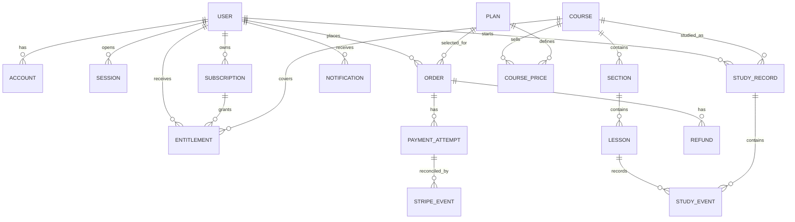

# Phase 1：数据设计

## 1. 实体关系



## 2. 表和关键字段

| 表 | 必要字段 | 约束 |
|---|---|---|
| `users` | `id`, `email`, `status`, `locale`, `nickname`, `created_at` | email 唯一；nickname 仅英文、最多 15 个字符、禁止特殊字符 |
| `accounts` | `user_id`, `provider`, `provider_subject` | `(provider, provider_subject)` 唯一；provider 账号不按 email 自动合并 |
| `sessions` | `id`, `user_id`, `expires_at`, `revoked_at` | reset password 后撤销旧 session |
| `courses` | `id`, `slug`, `category_id`, `status`, `public_first_lesson_id` | `slug` 唯一；只发布完整内容 |
| `sections` / `lessons` | parent id、`sort_order`、title、content、duration、status | 同一 parent 下 `sort_order` 唯一；发布时锁定版本 |
| `plans` / `course_prices` | scope、scope id、device、term months、currency、amount、stripe price id | plan 配置由 Course Manager/Operator 管理；金额以最小货币单位保存 |
| `orders` | `user_id`, `plan_id`, `amount`, `currency`, `status`, `source` | 金额由服务端 quote 生成；不能由客户端传入最终金额 |
| `payment_attempts` | `order_id`, `stripe_checkout_session_id`, `stripe_payment_intent_id`, `status` | 外部 id 可唯一；记录每次尝试，不覆盖历史 |
| `stripe_events` | `event_id`, `event_type`, `payload`, `processed_at`, `result` | `event_id` 唯一；重复 webhook 返回 200 且不重复写入 |
| `subscriptions` | `user_id`, `plan_id`, `state`, `valid_from`, `valid_to`, `cancel_at_period_end`, `stripe_subscription_id` | 状态转换只由 Subscription Management / Payment Management 写入 |
| `entitlements` | `user_id`, `scope`, `scope_id`, `device`, `state`, `valid_to`, `source` | 访问判断只使用当前有效记录；历史不删除 |
| `study_records` / `study_events` | user/course/lesson、event type、seconds、client event id | client event id 唯一；时间累计由服务端限制上限并去重 |
| `notifications` | `user_id`, `type`, `title`, `body`, `read_at` | 逐条读写；header unread count 使用查询结果 |
| `audit_events` | actor、action、entity、payload、created_at | Refund、Resynchronise Payment、发布和权限变化必须有记录 |

## 3. 状态规则

WeChat Account additions: `wechatAppId`, `wechatOpenId`, optional `wechatUnionId`; `providerSubject` is `${appId}:${openid}`. `User.email` is nullable; absent email means `emailVerifiedAt = null`. An active linked WeChat account is sufficient for application Session validation, while password login continues to require verified email.

The current JSON store migrates a legacy unscoped OpenID/UnionID on the next successful provider authentication, using only IDs returned by WeChat. It retains userId and associated records, clears legacy `wechat-*@local.invalid` email and verification, and rejects multiple matching Accounts. Existing real contact email is preserved. With missing UnionID, a legacy UnionID-only identity cannot be recovered until WeChat returns that ID. Before changing AppID or enabling multi-instance traffic, reconcile legacy Accounts and migrate to relational repositories with unique `(provider, provider_subject)` constraints. No SQL alteration is applied here: this checkout currently stores product records in JSON through `app_files`, not relational users/accounts tables.

```text
Trial Active -> Trial Canceled -> Trial Active（原 trial_end_at 之前可恢复）
Trial Active -> Trial Expired
Active Subscription -> Cancel at Period End -> Expired
Active Subscription -> Payment Grace -> Active Subscription 或 Expired
Order: created -> checkout_open -> paid / failed / canceled
PaymentAttempt: created -> pending -> succeeded / failed / refunded
```

状态变更必须在一个数据库事务中完成所需的 `Order`、`PaymentAttempt`、`Subscription`、`Entitlement` 写入。外部 webhook 乱序时，以 Stripe 当前对象状态重新读取并安全重算。浏览器回成功页不是付款凭证；页面不订阅支付事件，下一次导航或刷新才读到新状态。详见 [`payment-state-propagation.md`](./payment-state-propagation.md)。

## 4. PostgreSQL 迁移顺序

```text
001_users_accounts_sessions.sql
002_courses_sections_lessons.sql
003_plans_prices.sql
004_orders_payment_attempts_stripe_events.sql
005_subscriptions_entitlements.sql
006_study_records_events.sql
007_notifications_audit_events.sql
008_app_files_and_ks_links.sql
```

本地可用 Docker PostgreSQL；DEV/SIT/UAT/PPE/PROD 使用各自 RDS database 或 schema，不共享生产数据。
