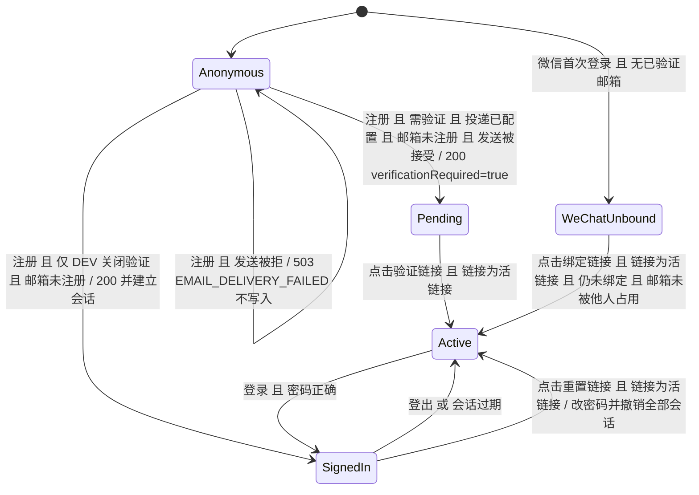

# 认证邮件状态机

本文说明 Learning Guide Phase 1 里四条"发邮件"流程的状态、转移和输出规则，以及为什么要按这个顺序实现。读者是开发和产品：开发用它核对代码，产品用它确认用户在每一步能看到什么。

## 1. 范围

基线是 upstream main `8a77712`，加上 PR [#25](https://github.com/LibertychaserUS/LearningGuidePortal/pull/25) 的改动。只覆盖四条流程：

| 流程 | 接口 | 服务代码 |
|------|------|----------|
| 注册验证 | `POST /api/auth/register`（`/api/auth/sign-up`）、`POST /api/auth/admin/register` | `services/emailRegistration.ts` |
| 重发验证邮件 | `POST /api/auth/resend-verification` | `services/emailResend.ts` |
| 找回密码 | `POST /api/auth/password-reset/request`、`POST /api/auth/password-reset/confirm` | `services/passwordResetService.ts` |
| 微信账号绑定邮箱 | `POST /api/auth/email-binding/request`、`POST /api/auth/email-binding/confirm` | `services/emailBindingService.ts` |

数据读写都在 `services/productStore.ts`；邮件发送在 `services/emailService.ts`。激活链接的确认（`/api/auth/verify-email`）、登录和登出只作为状态转移的另一端出现。

## 2. 状态空间

### 2.1 账号状态

以某个邮箱地址为视角，服务端记录的状态只有以下几种：

| 状态 | 含义 | 服务端事实 |
|------|------|------------|
| Anonymous | 这个邮箱没有账号 | `users` 里没有该 email |
| Pending | 邮箱账号已注册、未验证 | `status = "pending"`，`emailVerifiedAt = null` |
| Active | 邮箱已验证，账号可用 | `status = "active"`，`emailVerifiedAt` 有值 |
| SignedIn | Active 且持有有效会话 | Active + `sessions` 里有未过期记录 |
| WeChatUnbound | 微信账号，尚无已验证邮箱 | `status = "active"`，有 `provider = "wechat"` 的 account，`email` 或 `emailVerifiedAt` 为空；会话只能用于绑定邮箱和登出 |

SignedIn 不是另一种账号，只是 Active 加一条会话。WeChatUnbound 绑定成功后进入 Active（该用户原来的受限会话随即成为完整会话，即 SignedIn）。

### 2.2 链接是状态的属性

邮件里的链接不是独立状态，而是账号状态上的一个属性：

| 链接 | 属于哪个状态 | 取值 | 有效期 | 存储 |
|------|-------------|------|--------|------|
| 验证链接 | Pending | 无，或恰好一条未使用的活链接 | 24 小时 | `verificationTokens` |
| 重置链接 | Active / SignedIn | 无，或恰好一条未使用的活链接 | 1 小时 | `passwordResetTokens` |
| 绑定链接 | WeChatUnbound | 无，或恰好一条活链接（旧链接直接删除） | 24 小时 | `emailBindingTokens` |

数据库只存链接的哈希（`tokenHash`），原始 token 只出现在内存和邮件里。"活链接"指未使用、未过期、未被替换的那一条。冷却时间（60 秒）按该用户最新一条**已存储**链接的 `createdAt` 计算。

### 2.3 不在状态空间里的东西

邮箱服务商是否收下、是否进了垃圾箱、用户是否打开邮件、是否点击链接、浏览器里是什么页面——这些服务端都看不到，也不建模。服务端只观察两类东西：

1. 请求本身（注册、重发、找回、绑定、点击链接、登录）；
2. 邮件传输层（SMTP / SES）对一次发送给出的回执：接受（accepted）或拒绝（rejected，包括抛错、超时、配置错误）。

因此：

- **没有输入，状态不变。** 用户不点链接，账号就停在当前状态，直到链接过期；过期不是转移，只是链接属性不再算"活"。
- **重复输入是幂等的。** 重复点同一个已用链接、重复注册同一邮箱、冷却期内重复请求，都不改变状态。

## 3. 形式化表述

记合法状态集合为 \(Q_L\)，输入字母表为 \(\Sigma\)，合法公开输出集合为 \(Y_L\)。一次请求的输入不只是请求本身，还包括发送回执：

\[
\Sigma \ni \text{request} \cdot \text{accepted} \quad\text{或}\quad \text{request} \cdot \text{rejected}
\]

转移函数和输出函数是：

\[
\delta : Q_L \times \Sigma \to Q_L, \qquad \lambda : Q_L \times \Sigma \to Y_L
\]

要求是封闭性：从任何合法状态出发，对任何输入（包括发送被拒），下一状态仍在 \(Q_L\) 里，公开输出仍在 \(Y_L\) 里。

非法状态的例子：Pending 但用户从未收到任何验证邮件；旧链接已作废、新链接从未送达；冷却期正在计时，但计时起点是一封没发出去的邮件；Active 账号仍持有活的验证链接；同一邮箱的已知账号和未知地址得到不同的公开响应。

这些状态不是"出现后再处理"，而是通过转移的顺序让它们**不可达**：只有发送被接受之后才写入，所以"已写入但未送达"这种状态根本不会产生。不需要清理任务、人工解锁或补偿流程。

## 4. 状态图

图里只画改变账号状态的转移，外加 Anonymous 上唯一一条"注册发送被拒"的自环。守卫写在箭头上。链接属性的变化（重发、再次申请重置、再次申请绑定）和其他不改变账号状态的事件见第 5 节的表。

## 5. 转移表

表里"下一状态"写"不变"表示账号状态和链接属性都不变；写"不变（换链接）"表示账号状态不变，但活链接被新的一条替换。

### 5.1 注册验证（需要验证时）

| 当前状态 | 输入 | 守卫 | 下一状态 | 公开输出 |
|----------|------|------|----------|----------|
| 任意 | 注册 | 投递未配置 | 不变 | 503 `EMAIL_DELIVERY_NOT_CONFIGURED`（在查账号之前判断） |
| 任意 | 注册 | 输入不合法 | 不变 | 400 `REGISTRATION_FAILED` |
| Anonymous | 注册 · accepted | 邮箱未注册 | Pending，带一条 24h 活链接 | 200 `{ verificationRequired: true }`，不返回 user，不建会话 |
| Anonymous | 注册 · rejected | 邮箱未注册 | 不变（仍是 Anonymous） | 503 `EMAIL_DELIVERY_FAILED`，什么都不写 |
| Pending / Active / SignedIn / 任意已有该邮箱的账号 | 注册（重复） | 邮箱已存在 | 不变，不发信 | 200 `{ verificationRequired: true }`，与新注册完全相同 |
| Anonymous | 注册（并发两次同一邮箱，两封都被接受） | 提交时再查邮箱 | Pending，只有先提交的那条链接和密码 | 两次都是 200 `{ verificationRequired: true }` |

DEV 且 `EMAIL_VERIFICATION_REQUIRED=0` 时走旧路径：Anonymous 直接进入 SignedIn，返回 200 `{ user, verificationRequired: false }` 并种会话 Cookie；重复注册返回 200 `{ verificationRequired: false }`。托管环境（SIT、UAT、PROD、PPE/PROD、PRODUCTION）永远需要验证。

### 5.2 重发验证邮件

| 当前状态 | 输入 | 守卫 | 下一状态 | 公开输出 |
|----------|------|------|----------|----------|
| 任意 | 重发 | 投递未配置 | 不变 | 503 `EMAIL_DELIVERY_NOT_CONFIGURED`（在查账号之前判断） |
| Anonymous / Active / SignedIn | 重发 | 没有该邮箱的 Pending 账号 | 不变，不发信 | 200 `{ accepted: true }` |
| Pending | 重发 | 距最新已存链接不足 60 秒 | 不变，不发信 | 200 `{ accepted: true }` |
| Pending | 重发 · rejected | 冷却已过 | 不变，旧活链接仍有效，冷却不重新计时 | 200 `{ accepted: true }` |
| Pending | 重发 · accepted | 冷却已过；提交时仍是 Pending | 不变（换链接）：旧链接作废，新链接 24h | 200 `{ accepted: true }` |
| Active（在发送和提交之间被激活） | 重发 · accepted | 提交时已不是 Pending | 不变，不存新链接 | 200 `{ accepted: true }` |
| Pending | 点击验证链接 | 链接为活链接 | Active；该用户其余验证链接全部作废 | 200 |
| 任意 | 点击验证链接 | 链接无效、过期、已用或已被替换 | 不变 | 400 `VERIFICATION_TOKEN_INVALID` |

重发不再返回 429。所有非"未配置"的情况都是同一个 200，所以响应不暴露地址是否存在、是否在冷却、发送是否失败。

### 5.3 找回密码

| 当前状态 | 输入 | 守卫 | 下一状态 | 公开输出 |
|----------|------|------|----------|----------|
| 任意 | 申请重置 | 邮箱格式不合法 | 不变 | 400 `invalid_request` |
| 任意 | 申请重置 | 托管环境且投递未配置 | 不变 | 503 `email_unavailable`（在查账号之前判断） |
| 任意 | 申请重置 | 托管环境且公开源站（`NEXT_PUBLIC_APP_URL`）不可用 | 不变 | 503 `email_unavailable`（在查账号之前判断） |
| 任意 | 申请重置 | 投递已配置、公开源站可用，且请求的 Origin 头既不是公开源站也不是请求源站 | 不变 | 400 `invalid_request`（在查账号之前判断） |
| Anonymous / Pending / WeChatUnbound | 申请重置 | 没有该邮箱的 Active 已验证账号 | 不变，不发信 | 200 `{ ok: true, accepted: true, retryAfter: 60 }` |
| Active / SignedIn | 申请重置 | 距最新已存重置链接不足 60 秒 | 不变，不发信 | 同上 200 |
| Active / SignedIn | 申请重置 · rejected | 冷却已过 | 不变，旧活链接仍有效，冷却不重新计时 | 同上 200 |
| Active / SignedIn | 申请重置 · accepted | 冷却已过；提交时仍是 Active 已验证 | 不变（换链接）：旧重置链接作废，新链接 1h | 同上 200 |
| Active | 点击重置链接并提交新密码 | 链接为活链接，新密码至少 8 位 | Active，密码更新，链接作废 | 200 |
| SignedIn | 点击重置链接并提交新密码 | 同上 | Active（该用户全部会话被撤销） | 200 |
| 任意 | 点击重置链接 | 链接无效、过期、已用或已被替换 | 不变 | 400 |

发送被拒时，已知账号和未知地址的响应完全相同。只有"投递未配置"和"托管环境源站不可用"会返回 503，这两者都在查账号之前判断，对所有地址一样。

#### 5.3.1 DEV 无传输路径与预览链接：合同与代码对账

DEV 且没有配置任何邮件传输时（非托管环境；`EMAIL_DELIVERY=discard|fail` 算已配置），代码保持 `8a77712` 的行为：调用 `requestPasswordReset(email, true)` 为合格账号存一条重置链接，返回同一个 200 `{ ok: true, accepted: true, retryAfter: 60 }`；链接不会被发出，也不会出现在响应里。这条路径是先写、不发，不在本文的合法性保证之内，本 PR 不改它。

- 合同原来写：accepted 响应是 `{ ok: true, accepted: true, retryAfter: 60, resetUrl: null }`；`APP_ENV=DEV`、`LOCAL_PASSWORD_RESET_PREVIEW=1` 且无传输时返回预览链接。
- 代码实际：路由只返回 `{ ok, accepted, retryAfter }`，没有 `resetUrl` 键（既不是 `null`，也不是链接）。产品代码不读 `LOCAL_PASSWORD_RESET_PREVIEW`；`services/runtimeConfig.ts` 的 `localResetPreviewAllowed` 只有 `tests/unit/sit-runtime.test.ts` 在调用。
- 改了哪一边：合同。`api-contracts.md` 改为 accepted 响应恰为 `{ ok: true, accepted: true, retryAfter: 60 }`、没有预览链接；`release-runbook.md` 同步。代码不改。
- 为什么不实现预览：
  1. 预览是有意删掉的，不是漏接。`7f42330` 加入预览（`passwordResetService.ts` 在 DEV + flag + 无传输时返回 `resetUrl`，路由把服务结果整体展开返回），合同段落也是这次写的。`f44301f`（"fix: close Overlay AUTH/PAY leaks and lock them in tests"，提交说明 "Reset JSON never includes resetUrl"，与 Oliver 共同署名）删掉了 `localResetPreviewAllowed` 与 flag 判断，路由改为只取 `accepted` / `retryAfter`，但没有同步合同，才留下矛盾。两个提交都在 upstream main 上。
  2. 规格黑盒不允许。`inbox/login.md` 用户用例 2："Password-reset JSON never includes resetUrl or a raw token"；Notes："Do not rewrite AUTH-01 / AUTH-02 to accept `exists`, `resetUrl`, or 503"。`overlay-forge-brief.md` 的规格红表把"DEV preview 会漏 `resetUrl`"列为产品缺陷。login 套件是 `active`，实现预览就要让 AUTH-02 在某个配置下接受 `resetUrl`，等于改锁。
  3. 预览只给合格账号带链接，公开响应因此暴露地址是否对应 Active 账号，违反第 6 节不变量 7。
  4. 现有锁：`tests/integration/password-reset.spec.ts` 用 `toEqual({ ok: true, accepted: true, retryAfter: 60 })` 锁住 DEV 无传输响应；`tests/io/login.test.ts` 的 AUTH-02 / AUTH-03 断言 `body.resetUrl === undefined`。
- 残留（本 PR 不动，清理是单独的改动）：`contracts/passwordReset.ts` 的 `PasswordResetResult.resetUrl` 是服务内部类型，服务恒返回 `null`，路由不透出；`components/portal/PasswordResetRequestForm.tsx` 在响应带 `resetUrl` 时仍会渲染 `messages/*.json` 的 `resetPreview` 链接，这条分支现在不可达；`localResetPreviewAllowed` 没有产品调用方。

### 5.4 微信绑定邮箱

调用方已登录（持有 WeChatUnbound 的受限会话），所以这里可以直接告诉调用方发送失败。

| 当前状态 | 输入 | 守卫 | 下一状态 | 公开输出 |
|----------|------|------|----------|----------|
| 无会话 | 申请绑定 | — | 不变 | 401 `unauthorised` |
| WeChatUnbound | 申请绑定 | 投递未配置 | 不变 | 503 `email_unavailable` |
| WeChatUnbound | 申请绑定 | Origin 头不匹配 | 不变 | 400 `unauthorised` |
| WeChatUnbound | 申请绑定 | 邮箱格式不合法 | 不变 | 400 `invalid_email` |
| SignedIn（非微信账号，或已绑定） | 申请绑定 | 不是微信账号 / 已有已验证邮箱 | 不变 | 400 `unauthorised` / 400 `already_bound` |
| WeChatUnbound | 申请绑定 | 邮箱已被其他用户占用 | 不变 | 400 `email_in_use` |
| WeChatUnbound | 申请绑定 | 距最新已存绑定链接不足 60 秒 | 不变，不发信 | 429 `cooldown` |
| WeChatUnbound | 申请绑定 · rejected | 以上守卫都通过 | 不变，旧链接仍有效，冷却不重新计时 | 503 `email_unavailable`，什么都不写 |
| WeChatUnbound | 申请绑定 · accepted | 提交时再查：仍是微信账号、仍未绑定、邮箱仍未被占用 | 不变（换链接）：删除旧绑定链接，存新链接 24h | 200 `{ ok: true, accepted: true, retryAfter: 60 }` |
| WeChatUnbound | 申请绑定 · accepted | 提交时再查失败（期间邮箱被占用或已绑定） | 不变，不存链接 | 对应的 400 `email_in_use` / `already_bound` |
| WeChatUnbound | 点击绑定链接 | 链接为活链接，仍未绑定，邮箱未被占用 | Active（邮箱写入并标记已验证） | 200 `{ alreadyBound: false, sameUser, continueUrl }` |
| Active（已用该链接绑定） | 再次点击同一链接 | 链接已用且用户邮箱等于链接邮箱 | 不变 | 200 `{ alreadyBound: true, ... }` |
| 任意 | 点击绑定链接 | 链接无效、过期或已被替换；或邮箱被占用 | 不变 | 400 |

### 5.5 登录（只列与 Pending 有关的事件）

| 当前状态 | 输入 | 守卫 | 下一状态 | 公开输出 |
|----------|------|------|----------|----------|
| Pending | 登录 | 任意密码 | 不变，不建会话 | 401 `AUTHENTICATION_FAILED`，与未知地址、错误密码相同 |
| Active | 登录 | 密码错误 | 不变 | 401 `AUTHENTICATION_FAILED` |

## 6. 不变量

1. 需要验证时，没有一次被接受的发送，就不会出现新用户，也不会出现新链接。
2. 一条活链接只会在它的替代链接已经送达（发送被接受）之后才作废。发送被拒时，原来的活链接保持有效。
3. 冷却只按已存储（已送达）的链接计时；发送被拒不会开始冷却。
4. 每个账号每类链接至多一条活链接。
5. 验证链接只挂在 Pending 上；Active 账号不会持有活的验证链接。
6. 有会话 ⇒ Active（邮箱账号），或 WeChatUnbound 的受限会话；Pending 永远没有会话。
7. 公开（未登录）接口的响应不暴露账号是否存在：已知地址、未知地址、冷却中、发送被拒，得到相同的状态码和响应体。
8. token 原文从不出现在 API 响应里，数据库只存哈希。

## 7. 统一的转移步骤

四条流程的"申请"一侧都按同一个顺序执行：

1. **只读。** 读已提交的状态，判断守卫：投递是否配置、账号是否符合条件、是否在冷却。这一步不写任何东西。
2. **守卫失败就返回。** 状态不变。
3. **在内存里生成原始 token，发送包含它的邮件。**
4. **发送被拒：** 返回合同规定的输出，什么都不写。
5. **发送被接受：** 在**一个** `editData` 事务里，重新检查可能被并发请求破坏的条件（邮箱是否已被注册 / 占用、是否仍是 Pending / Active / 未绑定），然后作废旧链接、写入新 token 哈希（注册时连同用户一起写入）。
6. **根据已提交的结果计算输出。**

对应的存储函数：

| 流程 | 只读规划 | 发送后提交 |
|------|----------|-----------|
| 注册 | `emailAlreadyRegistered`（`services/emailRegistration.ts`） | `commitPendingUserWithToken` |
| 重发 | `resendVerificationEmail` 内的只读查找 | `replaceLiveVerificationToken`（提交时再查仍是 Pending） |
| 找回密码 | `planPasswordReset` | `replaceLivePasswordResetToken`（提交时再查仍是 Active 已验证） |
| 绑定邮箱 | `planEmailBinding` | `commitEmailBinding`（提交时再查资格与邮箱唯一性） |

旧的一步式函数 `requestPasswordReset`、`issueEmailBinding`、`issueEmailVerificationToken` 仍然导出，语义不变，供现有测试和 DEV 路径直接调用；服务层的申请流程不再使用它们（DEV 无传输的重置路径除外，见 5.3.1）。

输出规则：

- "投递未配置"的判断放在任何账号查询之前，对所有地址返回同一个 503。
- 公开（未登录）流程里，发送被拒的输出与未知地址的输出完全相同。
- 冷却只看已提交（已送达）的链接，所以发送失败不会开始冷却。
- 已登录流程（绑定邮箱）可以直接返回 503 `email_unavailable`，因为调用方身份已知，不存在枚举问题。

## 8. 发现的缺陷：修复前与修复后

| # | 缺陷（`8a77712`） | 位置 | 修复后 |
|---|------|------|--------|
| 1 | 注册先写后发：`registerUserAttempt` 写入 Pending 用户、`issueEmailVerificationToken` 写入 token 并开始冷却，然后才 `sendVerificationEmail`。发送失败时返回 400 `REGISTRATION_FAILED`，但账号已经卡在"Pending 且从未收到邮件"，60 秒内重发还被冷却挡住 | `app/api/auth/register/route.ts`、`app/api/auth/admin/register/route.ts` | 先发后写，发送被拒返回 503 `EMAIL_DELIVERY_FAILED` 且不写入；发送被接受后 `commitPendingUserWithToken` 在一个事务里写用户和 token（`45b0495`） |
| 2 | 重发先作废后发：`requestEmailVerification` 先把旧链接标记已用、写新 token、开始冷却，再发送。发送失败返回 400 `EMAIL_DELIVERY_FAILED`——旧链接已死、新链接没送达；而且只有 Pending 地址会得到 400，泄露账号存在。路由里的 429 分支不可达，因为冷却在 `requestEmailVerification` 里被吞成 accepted | `app/api/auth/resend-verification/route.ts`、`services/productStore.ts` `requestEmailVerification` | 只读查找 + 冷却按已存链接计算 + 发送 + 成功后 `replaceLiveVerificationToken`；除"未配置"外一律 200 `{ accepted: true }`，去掉 429（`45b0495`）；提交时再查仍是 Pending（本 PR 后续提交） |
| 3 | 重复注册返回 `verificationRequired: false`。前端 `components/portal/AuthForm.tsx` 看到 false 会跳到 `returnTo`（或 My Learning），而不是 check-email 页；同时与新注册的 `true` 不同，泄露邮箱已注册 | `app/api/auth/register/route.ts` | 需要验证时重复注册返回与新注册相同的 200 `{ verificationRequired: true }`，不发信、不写入（`45b0495`） |
| 4 | 找回密码先作废后发：`requestPasswordReset(email, true)` 用 `issueToken("passwordResetTokens", …)` 作废旧重置链接、写新链接，再 `sendPasswordResetEmail`。托管环境发送失败抛 `email_unavailable` → 503，而未知地址是 200，传输故障期间状态码泄露账号存在（违反 AUTH-02）；旧链接已死、新链接没送达；新链接还开始了冷却，立刻重试得到 200 但不发信。另外"托管环境源站不可用 → 503"和"Origin 头不匹配 → 400"两个判断只在账号存在时才执行，同样泄露账号存在 | `services/passwordResetService.ts`、`services/productStore.ts` `requestPasswordReset` | 源站与 Origin 判断移到查账号之前；`planPasswordReset` 只读判断资格和冷却；发送；成功后 `replaceLivePasswordResetToken`。发送被拒返回与未知地址相同的 200，什么都不写 |
| 5 | 绑定邮箱先删后发：`issueEmailBinding` 检查冷却、删除该用户的旧绑定链接、写新链接，再 `sendEmailBindingEmail`。发送失败返回 503，但新链接已写入：旧链接没了，冷却已开始，立刻重试得到 429，而实际上一封邮件都没送达 | `services/emailBindingService.ts`、`services/productStore.ts` `issueEmailBinding` | `planEmailBinding` 只读判断资格、唯一性和冷却；发送；成功后 `commitEmailBinding` 在同一事务里再查资格与唯一性后写入。发送被拒仍是 503 `email_unavailable`，但什么都不写，立刻重试不是 429 |
| 6 | Pending 相关的 I/O 测试是空转的。`tests/io/login.test.ts` 的 `registerPending` 设置 `EMAIL_VERIFICATION_REQUIRED=1` + `EMAIL_DELIVERY=discard` 来造一个 Pending 账号，但 `8a77712` 的 `services/emailService.ts` 不认识 `EMAIL_DELIVERY=discard`，注册直接返回 503；`registerAccount` 又不检查响应。AUTH-01 的两个 Pending 用例实际比较的是两个都不存在的地址，无论实现对错都会通过 | `tests/io/login.test.ts` | `45b0495` 让 `discard` 成为已配置的无网络传输；本 PR 让 `registerPending` 断言前置条件：200、`verificationRequired === true`、无会话、存储里有 Pending 用户、Pending 登录为 401。前置条件不成立时用例直接失败 |

缺陷 6 的证据：在 `8a77712` 的临时 worktree 里用一次性脚本（未提交）按 `registerPending` 的环境调用注册路由，结果为 `registerStatus: 503`、`code: "EMAIL_DELIVERY_NOT_CONFIGURED"`、`userExists: false`，随后该地址与一个随机未知地址的登录都是 401 `AUTHENTICATION_FAILED`。把本 PR 的 `tests/io/login.test.ts` 放到 `8a77712` 上运行，两个 Pending 用例都以 `registerPending precondition: register must return 200` 失败；在本 PR 分支上 24 个用例全部通过。

## 9. 需求还是缺陷

判断标准：**如果缺陷不存在，这个流程还需要吗？**

- 重发验证邮件：需要。邮件可能进垃圾箱、可能被用户删掉、链接会过期。它来自需求（`docs/phase1/requirements-map.md` Registration & Authentication："The Portal check-email and verify-email pages cover resend …"；`docs/phase1/api-contracts.md`："resend uses `POST /api/auth/resend-verification`"）。
- 24 小时有效、一次性：来自需求（requirements-map："a one-time 24-hour verification token"）。重置链接 1 小时、一次性、重发作废旧链接：来自 api-contracts 的 Password reset 条目。
- 60 秒冷却：来自需求（requirements-map 找回密码条目："a 60-second resend cooldown"；api-contracts 找回密码与绑定邮箱条目：`retryAfter: 60`、cooldown (429)）。

所以本 PR 的修复只改变 \(\delta\) 和 \(\lambda\)（什么时候写、写什么、返回什么），没有增加任何补偿流程。只有那些专门用来把账号从非法状态里救出来的东西——例如定时清理"从未收到邮件的 Pending 账号"的任务、后台"手动解锁"按钮、重试队列——才算补偿。按第 7 节的顺序实现后，非法状态不可达，这些都不需要。

## 10. 取舍与边界

**接受的残余情况：**

- 发送被接受，但随后的提交失败（例如存储写入出错）；或者两个并发请求都发送成功、只有一个提交成功。此时用户手里可能有一封链接已失效的邮件。
- 状态仍然合法：账号要么仍是原状态（旧活链接不变），要么只有一条活链接。用户点击失效链接得到 400，页面引导重发 / 重新申请即可恢复。
- 不做 outbox。outbox 会引入"已存储但尚未送达"的新状态，以及它自己的重试、放弃、过期转移。这四条流程的输入本来就可以由用户重复发出（重发、重新申请），不需要服务端代为重试，引入 outbox 只会扩大状态空间。

**不在本文保证范围内：**

- 邮件被传输层接受之后是否真正进入用户收件箱。
- DEV 无传输时的找回密码路径（见 5.3.1）。
- 文件存储在多实例下的并发语义（`requirements-map.md` 已注明当前文件存储只适用于单实例 DEV）；第 7 节第 5 步的再检查依赖 `editData` 的串行化。

## 11. 测试对照

| 转移 / 不变量 | 测试文件 | 用例 |
|---------------|----------|------|
| 注册 · accepted → Pending；重复注册不变且输出相同 | `tests/unit/register-legal-transition.test.ts` | discard register keeps one pending user and the original password until verify |
| 注册 · rejected → 不变，503 | 同上 | failed verification mail does not commit the user |
| 注册，投递未配置 → 503 | 同上；`tests/io/login.test.ts` | missing mail configuration does not commit the user；AUTH-05 negative: verification required without mail delivery is 503 |
| 重发 · rejected → 链接不变，200 | `tests/unit/register-legal-transition.test.ts` | resend send failure stays accepted and keeps the unused token hash |
| 重发提交时已 Active → 不存链接 | 同上 | a verification link is not stored for an account that became active before the commit |
| 重发未知地址与 Pending 输出相同 | 同上；`tests/io/login.test.ts` | resend of an unknown email matches the pending resend shape；AUTH-01 edge: resend-verification does not 429 only for a pending address |
| DEV 关闭验证 → SignedIn | `tests/unit/register-legal-transition.test.ts` | verification disabled register still opens a session |
| Pending 登录 401，与未知地址相同 | `tests/io/login.test.ts` | AUTH-01 negative: login does not 403 only for a pending address（`registerPending` 前置条件断言） |
| 验证链接一次性、Pending → Active | `tests/integration/email-verification.spec.ts` | email registration requires a one-time verification token before sign-in |
| 重置 · rejected → 与未知地址相同，链接不变，旧链接仍可用 | `tests/unit/password-reset-legal-transition.test.ts` | rejected reset mail answers like an unknown address and keeps the live link |
| 重置 · rejected 不开始冷却；accepted 换链接；冷却按已存链接 | 同上 | a rejected send does not start the cooldown and an accepted send replaces the link |
| 托管环境发送被拒不再 503-vs-200 泄露 | 同上 | managed environment answers 200 for known and unknown addresses when the send is rejected |
| 托管环境未配置投递 → 所有地址 503 | 同上；`tests/io/login.test.ts` | managed environment without delivery returns 503 before any account lookup；AUTH-03 functional: APP_ENV=PRODUCTION does not leak a reset URL |
| 托管环境源站不可用 → 所有地址 503 | `tests/unit/password-reset-legal-transition.test.ts` | managed environment without a public origin returns 503 for every address |
| Origin 头不匹配 → 所有地址 400 | 同上 | a foreign Origin header is rejected for known and unknown addresses alike |
| 重置发信、冷却、一次性确认、撤销会话 | `tests/integration/password-reset.spec.ts`；`tests/unit/sit-password-reset.test.ts` | DEV reset sends mail, preserves destination, throttles and consumes tokens once；SIT emails reset links on its trusted origin and never returns a token |
| 重置响应不含 token、不区分地址 | `tests/io/login.test.ts` | AUTH-02 functional / negative；AUTH-03 edge |
| DEV 无传输 → 200，响应恰为 `{ ok, accepted, retryAfter }`，没有 `resetUrl` 键（5.3.1） | `tests/integration/password-reset.spec.ts`；`tests/io/login.test.ts` | DEV reset sends mail, preserves destination, throttles and consumes tokens once（`unconfigured` 断言）；AUTH-03 edge: APP_ENV=DEV still allows a local password-reset request without a token leak |
| 绑定 · rejected → 503，不存链接，立刻重试成功（非 429） | `tests/unit/email-binding-legal-transition.test.ts` | a rejected binding mail stores no link and does not start the cooldown |
| 绑定 · rejected → 旧链接仍可用 | 同上 | a rejected binding mail keeps the previously delivered link usable |
| 绑定提交时再查唯一性 | 同上 | the commit re-checks uniqueness and stores nothing when the email was taken meanwhile |
| 绑定确认、冷却 429、替换旧链接、冲突、重放 | `tests/integration/email-binding.spec.ts` | WeChat binding requires verified email, keeps identity, blocks conflicts and replays safely |

## 12. 门禁现状

本 PR 的 `forge-check` 红在两项：`deny_paths` 和 `docs_sync`。两项都不是本 PR 引入的，本 PR 也不修。Overlay / Forge 登记处 `docs/phase1/overlay-forge-issues.md` 只在 fork 的 `main` / `dev` 上，本分支基于 upstream main，没有这个文件，所以先按登记处的格式记在这里；搬进登记处时续编号（那里最后一条是 OF-24，拟用 OF-25 / OF-26）。两条状态都是**待修**，处理归 Ops（Oliver）。本 PR 不改 `forge.yaml`、`docs/STATE.md`、`.github/workflows/`。

证据：fork 上本 PR 的 forge-check（[push run 35852854210](https://github.com/LibertychaserUS/LearningGuidePortal/actions/runs/35852854210)、[pull_request run 35852912877](https://github.com/LibertychaserUS/LearningGuidePortal/actions/runs/35852912877)）都是 `forge check: red (2 failed)`，红项只有 `deny_paths`（`diff touches .github/workflows/ci.yml`）和 `docs_sync`（`CI job 名与 .github/workflows 不一致；运行 forge status --write`）。在 fork 里对不含本 PR 的 `8a77712`（upstream main）用 `forge-v1.1.3` 重跑，红项相同；`forge status --check-state` 退出 2。

### G-1 docs_sync：`docs/STATE.md` 的 CI job 名落后于 workflow — 待修（Ops）

- 现象：`docs_sync` 报"CI job 名与 .github/workflows 不一致"；`forge status --check-state` 退出 2。
- 根因：`docs/STATE.md` 是 `forge status --write` 生成的快照，里面列了 CI job 名；`docs_sync` 拿它和 `.github/workflows/*.yml` 的 job 名比。upstream `522eeab`（2026-09-18，"feat: add catalogue migrations for DEV course sync"）新增 `.github/workflows/catalogue-sync.yml`，job 名 `Run catalogue migrations`；`STATE.md` 最后一次重生成是 `e3276b0`（2026-09-16），没有这个 job。所以 upstream main `8a77712` 本身就不过 `docs_sync`，任何基于它的分支都会红。
- 为什么进了 main：upstream 上 `522eeab` 自己的 forge-check（[run 35333759868](https://github.com/First-Light-TechHK/LearningGuidePortal/actions/runs/35333759868)，`push` 到 `main`）已经是红的，红项只有 `docs_sync`；GitHub 查不到与该提交关联的 PR。推断：它是直推 `main`，或 upstream 没有把 forge-check 设成 required，所以没被挡住。
- 修法：单独一个改动，在 upstream main 上跑 `forge status --write` 重生成 `STATE.md`（Ops / Oliver）。不在功能 PR 里手改 `STATE.md`。

### G-2 deny_paths：fork 上按 fork 的 `main` 算 diff，误报 `ci.yml` — 待修（Ops 定）

- 现象：`deny_paths` 报 `diff touches .github/workflows/ci.yml`，而本 PR 没有改任何 workflow。
- 根因：Forge 1.1.3 用 `git merge-base HEAD <protect 分支>` 作 diff 起点（`forge/check.py` 的 `resolve_protect_ref` 优先取 `refs/remotes/origin/main`，`list_changed_paths` 从 merge-base 算），不看 PR 的 base。fork 的 `origin/main` 是 fork 自己的 `main`（`8bac302`），已和 upstream 分叉：fork `main` 有 36 个 upstream 没有的提交，upstream 有 50 个 fork `main` 没有的提交（fork `dev` 有 34 个 upstream 没有的提交）。merge-base 是 `006536f`，"diff" 有 285 个路径，包括 upstream 改过的 7 个 workflow 文件。
- 为什么只命中 `ci.yml`：本分支的 `forge.yaml` 来自 upstream，没设 `deny_paths`，Forge 默认值 `DEFAULT_DENY = (".github/workflows/ci.yml",)`（`forge/apply.py`）生效。同一个 PR 在 upstream 仓里算，`origin/main` 是 upstream main，diff 只有本 PR 的文件；upstream `522eeab` 那次 run 就是 `deny_paths ok vs refs/remotes/origin/main`。
- 配置漂移：upstream 默认只保护 `ci.yml`；fork `main` / `dev` 的 `forge.yaml` 把整个 `.github/workflows/` 列进 `deny_paths`。
- 修法（Ops 选）：把 fork `main` 同步到 upstream；让 Forge 对 PR base 算 diff（工具改动）；或调整两边的 `forge.yaml`。本 PR 不改 `forge.yaml`。
