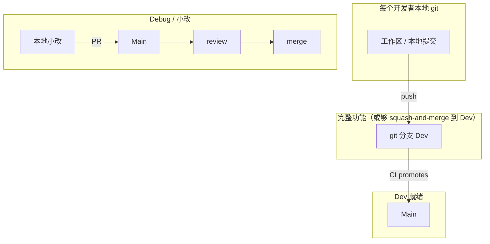
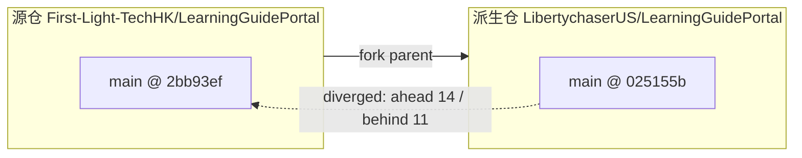
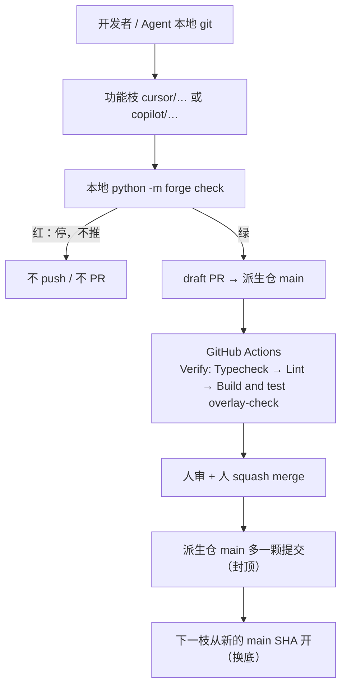
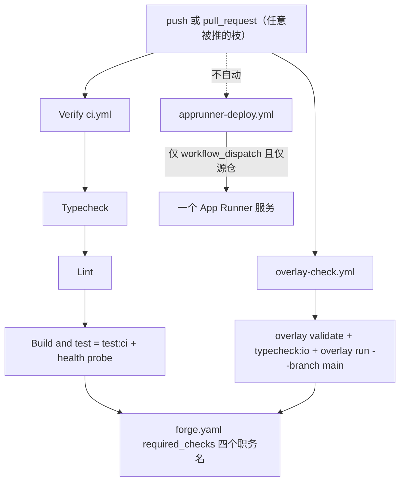
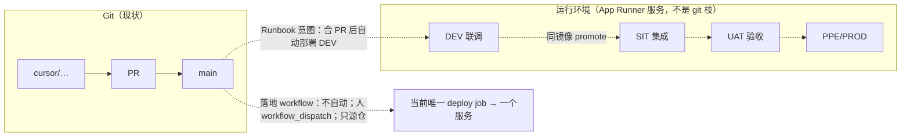

# 协作 Git 拓扑对照：Oliver 预想 vs 现状设计

**读者：** Oliver  
**性质：** 对照文档。只记录已写进仓里的设计和取证结果。**不是流程变更，也不是新 SOP。**  
**取证时刻：** 2026-09-11（UTC）  
**本文未改：** Overlay inbox / suites / Verify / 七份 PRD / `forge.yaml` / GitHub Rulesets。未 live-apply。未 rebase PR [#5](https://github.com/LibertychaserUS/LearningGuidePortal/pull/5)。未改 AIOps tag。

副本位置：

- 人工阅读（artifact）：`/opt/cursor/artifacts/git-collaboration-topology-compare.md`
- 产品仓工程入口（非 PRD）：`docs/phase1/git-collaboration-topology.md`

微信 / 飞书不渲染 Mermaid，每张图都附 ASCII。

---

## 0. 十行差距（先看这）

1. **没有 git 分支叫 `Dev` / `dev` / `develop`。** 派生仓、源仓、AIOps 三仓 `ls-remote --heads` 都没有。
2. **环境 `DEV` ≠ 分支 `Dev`。** `DEV` / `SIT` / `UAT` / `PPE/PROD` 是四个 AWS App Runner **服务**（同一镜像、不同配置），不是四条 git 线。
3. **没有「CI 把 Dev 提升到 Main」。** 现设计是功能枝开 PR → 人 squash 合进 `main`。CI 是门禁，不是晋升机器人。
4. **最接近今天的，是「小改 / debug：PR 到 Main → 审 → 合」。** 完整功能和小改走同一条路，只是 PR 大小不同。
5. **合 `main` 的是人，不是 CI，也不是 Agent。** Forge 不合入。默认 squash **封顶**，下一枝从新 `main` SHA **换底**。
6. **CI 在每次 `push` / `pull_request` 上跑**（Verify + overlay-check），不是「Dev 就绪才跑一次再推 Main」。
7. **Runbook 里的「提升」是 Docker 镜像跨环境**，不是 git `Dev` → `main`。落地的 deploy workflow 还是 `workflow_dispatch`，且只在源仓跑。
8. **派生仓 `main` 和源仓 `main` 已经分叉**（ahead 14 / behind 11），不是同一条主干。
9. **`forge.yaml` 写了 `protect: [main]`，GitHub Rulesets 两边都是 `[]`。** 政策在薄文件里，门还没装上。
10. **本文只对照，不发明「该不该建 Dev 枝」。** 要改拓扑，须另开决策，不能默默替换。

---

## 1. 证据从哪来（不靠猜）

| 来源 | 锁住的事实 |
|---|---|
| `AGENTS.md` | 四环境是 App Runner；同一镜像不同配置；Forge `check` → `submit`；不 live-apply；针 `overlay-v1.0.1` / `forge-v1.0.1` = `b4afc10ae0be4725e5109030f14a05bb2291fe4a` |
| `DESIGN.md` | UI / 模块 / i18n。**没有** git 分支拓扑，也没有把环境写成分支名 |
| `docs/phase1/release-runbook.md` §1 / §3 | 环境表；「不要用代码分支复制业务逻辑」；发布链是 PR → 测 → 镜像 → 环境 DEV → 同镜像升 SIT/UAT/PPE-PROD |
| `docs/phase1/production-configuration.md` | 本地 `APP_ENV=DEV` 是**进程环境变量**，不是 git 枝 |
| `docs/phase1/overlay-forge-brief.md` | CI DAG；deploy 不自动；仅源仓 `workflow_dispatch`；`forge.yaml` 保护 `main` |
| `forge.yaml` | `protect: [main]`；`agent_branch_prefixes: [cursor/, copilot/]`；`required_checks` = Typecheck / Lint / Build and test / overlay-check |
| `.github/workflows/ci.yml` | workflow 名 **Verify**；`on: pull_request` + `push`；**永不** `apprunner start-deployment` |
| `.github/workflows/overlay-check.yml` | 同上触发；`overlay run --branch main` |
| `.github/workflows/apprunner-deploy.yml` | **仅** `workflow_dispatch`；`if: github.repository == 'First-Light-TechHK/LearningGuidePortal'` |
| `$use-forge` / `$dev-pr` | 本地 `forge check` → draft PR；不直推 `main`；不合入 |
| `$manage-repo` | 人审、人合；默认 squash；Phase 1 **不**对本仓 live-apply |
| AIOps `docs/design.md` / `docs/pr-brief.md` / `forge/agent-policy.md` @ `overlay-v1.0.1` | 封顶 + 换底；`submit` base = `protect`（默认 `main`）；Forge 不合入；只做 CI 不做 CD |
| `git ls-remote --heads`（三仓） | 无 `Dev` / `dev` / `develop` |
| `gh api …/rulesets` | 派生仓、源仓都是 `[]` |
| `gh api repos/LibertychaserUS/LearningGuidePortal` | `fork: true`，`parent: First-Light-TechHK/LearningGuidePortal`，默认枝 `main` |

取证命令（可复跑；不要打印 token / deploy key）：

```text
git ls-remote --heads https://github.com/LibertychaserUS/LearningGuidePortal.git
git ls-remote --heads https://github.com/First-Light-TechHK/LearningGuidePortal.git
git ls-remote --heads https://github.com/LibertychaserUS/AIOps.git
gh api repos/LibertychaserUS/LearningGuidePortal/rulesets
gh api repos/First-Light-TechHK/LearningGuidePortal/rulesets
gh api repos/LibertychaserUS/LearningGuidePortal --jq '{fork,parent:.parent.full_name,default:.default_branch}'
gh api repos/LibertychaserUS/LearningGuidePortal/compare/First-Light-TechHK:main...main --jq '{ahead:.ahead_by,behind:.behind_by,status:.status}'
```

2026-09-11 结果摘要：

| 仓 | 默认枝 | 是否存在 `Dev`/`dev`/`develop` | Rulesets | 备注 |
|---|---|---|---|---|
| `LibertychaserUS/LearningGuidePortal` | `main` @ `025155b2c6d5807ccbe02ecfb73c5df85282e7b2` | **无** | `[]` | 派生仓 |
| `First-Light-TechHK/LearningGuidePortal` | `main` @ `2bb93ef932bb694192d11f23c1d93d32b6ebd5ec` | **无** | `[]` | 源仓。另有 `wechatpay`、`codex/sit-deployment`、`cursor/upstream-overlay-wf-2e0c`（后两者与 `main` 同 SHA） |
| `LibertychaserUS/AIOps` | `main` @ `b4afc10ae0be4725e5109030f14a05bb2291fe4a` | **无** | 未作为产品门取证 | 官方针 `overlay-v1.0.1` / `forge-v1.0.1` 剥开后同一 SHA。**不要改 tag。** |

`python -m forge status --repo …` 在本取证环境缺 `FORGE_GITHUB_TOKEN`，CLI 未跑成。等价只读面是上面的 `gh api …/rulesets` → `[]`。

对比派生仓 `main`…源仓 `main`：`status=diverged`，ahead 14，behind 11。

---

## 2. 预想拓扑（Oliver）

原文按他的表述照抄（英文四条 + 他提过的「协作 git 拓扑图」）：

> - Each developer has local git
> - After a complete feature (or enough to squash-and-merge to Dev), push to **Dev** branch
> - When Dev is ready, **CI promotes to Main**
> - Debug / small additions: PR to **Main**, review, then merge

他更早还要过一张 **协作 git 拓扑图**。下面按这四条画，不补充他没说的角色或工具。



ASCII：

```text
完整功能（或够 squash-and-merge 到 Dev）

  开发者本地 git  ──push──►  Dev 分支  ──CI promotes──►  Main


Debug / 小改

  开发者本地 git  ──PR──►  Main  ──review──►  merge
```

预想里有两条进 Main 的路：

| 路径 | 中间站 | 谁推到 Main |
|---|---|---|
| 完整功能 | git **Dev** | **CI**（Dev 就绪后 promote） |
| Debug / 小改 | 无 Dev | **人**（PR → review → merge） |

---

## 3. 现状拓扑（证据）

产品仓是 **一个 Next.js 部署单元**。协作面是 GitHub PR，不是「先落地 Dev 枝再由 CI 推 Main」。

### 3.1 仓与主干（fork main ≠ 源仓 main）



ASCII：

```text
First-Light-TechHK/LearningGuidePortal   （源仓，默认 main @ 2bb93ef）
        │
        │ fork
        ▼
LibertychaserUS/LearningGuidePortal      （派生仓，默认 main @ 025155b）
        │
        └── 与源仓 main 已分叉（ahead 14, behind 11）
            两边都没有 Dev / dev / develop
```

`overlay.yaml` 写的是 `product.repo: LibertychaserUS/LearningGuidePortal`，`default_ref` 钉死 SHA，禁止浮动 `main`。

### 3.2 代码怎么进 `main`（封顶 + 换底）

依据：`$dev-pr`、`$manage-repo`、`forge.yaml`、AIOps `docs/pr-brief.md` / `forge/agent-policy.md`（针 `overlay-v1.0.1`）。



ASCII：

```text
本地 git
   │
   ▼
功能枝  cursor/…  或  copilot/…     （forge.yaml agent_branch_prefixes）
   │
   ▼
python -m forge check                 （红：不推、不开 PR）
   │ 绿
   ▼
draft PR  ──base──►  派生仓 main      （submit 的 base = protect = main）
   │
   ▼
required checks（政策名，不是 workflow 名 Verify）
   Typecheck / Lint / Build and test / overlay-check
   │
   ▼
人审，默认 squash 合进 main            （Agent 不合；Forge 不合）
   │
   ▼
封顶：main 上只多一颗
换底：下一单从新的 main SHA 再开
禁止：拿即将被 squash 掉的旧 cursor/ 头当下一单 base
```

完整功能和 debug/小改 **同一条拓扑**。差别只在 PR 体积，没有「完整功能先上 Dev」这一层。

合入设置（派生仓 API）：`allow_squash_merge=true`，也允许 merge commit / rebase。政策文字写 **默认 squash**。Ruleset 未装，所以 GitHub 并未强制「必须 PR、必须检查绿」。

### 3.3 CI 何时跑



ASCII（与 `overlay-forge-brief.md` §4 一致）：

```text
              push / pull_request
               /              \
              /                \
      Verify ci.yml          overlay-check.yml
      Typecheck              checkout AIOps@overlay-v1.0.0 → _aiops
         ↓                      validate + typecheck:io + overlay run
       Lint
         ↓
  Build and test
         │
         └──► required_checks：Typecheck / Lint / Build and test / overlay-check

apprunner-deploy.yml ──不自动──► App Runner
  仅 workflow_dispatch，且仅 First-Light-TechHK 仓
```

要点：

- CI **不是**「Dev 就绪 → 晋升 Main」。任何 push/PR 都跑。
- Overlay 选择集钉的是 **`--branch main`**（armed 套件），与功能枝名无关。
- `overlay.yaml` 的 `branches:` 只声明了 `main`。
- Verify **不部署**。`ci.yml` 写明 never `start-deployment`。

### 3.4 环境部署 vs git 分支

`AGENTS.md` / `release-runbook.md` 原文：四个正式环境 DEV、SIT、UAT、PPE/PROD；**每个环境是一个 AWS App Runner 服务**，同一镜像结构、不同配置。

Runbook §1：「不要用代码分支复制业务逻辑。」



ASCII：

```text
Git 拓扑（现状）                    运行拓扑（现状设计）

cursor/… ──PR──► main              DEV  App Runner   测试数据，可重置
                                    SIT  App Runner   固定集成数据
                                    UAT  App Runner   脱敏验收数据
                                    PPE/PROD App Runner  生产数据

Runbook §3 写的发布链（镜像，不是 git 枝）：
  PR → typecheck/lint/test/build → Docker → ECR
    → deploy DEV → smoke
    → 同一 image 升 SIT → UAT → PPE/PROD

落地与 Runbook 的差（仍是「现状」，不是新流程）：
  Verify = 只测
  apprunner-deploy.yml = 人手 workflow_dispatch，且仅源仓
  派生仓合 main 不会自动部署任何环境
```

本地 `APP_ENV=DEV`（`production-configuration.md`）只说明这台进程按开发配置跑，**不**表示存在 git `Dev`。

### 3.5 PR #5（本文不动）

任务说明：[#5](https://github.com/LibertychaserUS/LearningGuidePortal/pull/5) 仍冲突，另一 worker 在换底；**不要 rebase #5。**

取证当时 GitHub 返回：`mergeable=MERGEABLE`，`mergeStateStatus=UNSTABLE`（检查未齐），`headRefOid=2a48ccc…`，`base=main@025155b`。本地曾见更旧头 `e3ebd78`，说明他枝在动。本文不改那条枝、不叠在那条枝上。

---

## 4. 对照表

| 维度 | Oliver 预想 | 现状（证据） |
|---|---|---|
| 本地开发 | 每人一份 local git | 相同。本地先 `forge check`（有 Overlay 则 validate + cover） |
| 完整功能落地 | 够了就 squash-and-merge / push 到 **Dev** | 开 `cursor/`（或 `copilot/`）枝，**draft PR 直接打派生仓 `main`**。没有 Dev 站 |
| 小改 / debug | **PR 到 Main**，review，merge | **同一条**：PR 到 `main`，人审，人合。这是最接近预想的一条 |
| 谁合 Main | 完整功能：CI promote；小改：人 merge | **只有人**。`$manage-repo`：检查绿 + 人批，默认 squash。Agent / Forge 不合 |
| CI 何时跑 | Dev 就绪后，CI 把 Dev 推到 Main | **每个 push / PR** 跑 Verify + overlay-check。CI 是门，不是晋升 |
| 环境部署 vs git 分支 | （预想把 Dev/Main 当 git 阶段） | **环境是 App Runner 服务**。git 只有 `main` + 短命功能枝。Runbook 的 promote 是 **同镜像换环境**，不是换枝 |
| 和 Forge 的关系 | 未出现在预想四条里 | Forge 管：保护哪些枝（政策=`main`）、agent 枝前缀、deny 路径、required checks、本地 check / submit。**不合入、不部署** |
| 和 Ruleset 的关系 | 未写 | `forge apply` 会装 `forge-protected-default`（禁直推 / 禁 force-push / 必须 PR）。**两边仓 Rulesets 现为 `[]`。Phase 1 不 live-apply** |
| 封顶 + 换底 | 预想只在「够 squash-and-merge 到 Dev」提过 squash | 现状锁的是 **进 `main` 的那颗**：一单封顶，合完换底。`submit` 只开到 `protect`/`main`，不开到另一条功能枝 |
| 源仓 vs 派生仓 | 预想未区分 | 派生仓先做 Overlay/Forge。源仓才有 App Runner dispatch。两条 `main` 已分叉 |

---

## 5. 差距（只登记，不发明补丁流程）

下列是「预想有、现状没有」或「两个词看起来像、实际不是同一物」。**不要**把本表读成实施清单。

1. **没有 git `Dev` 分支。** 三仓 heads 皆无 `Dev` / `dev` / `develop`。Forge `protect` 只有 `main`。Overlay `branches:` 只有 `main`。
2. **环境 `DEV` ≠ 分支 `Dev`。** 大写 `DEV` 是 App Runner / `APP_ENV`。Runbook 禁止用分支复制业务逻辑。
3. **没有「CI promotes Dev → Main」。** 没有晋升 job，没有 Dev 保护规则，没有 bot 直推 `main`。AIOps 设计写明：只做 CI，不做 CD；Forge 不合入。
4. **小改 PR-to-Main 已经是现状主路。** 完整功能并没有第二条「先 Dev 再晋升」的路。
5. **fork `main` ≠ 源仓 `main`。** 派生仓领先 14、落后 11。合进派生仓 `main` 不会自动出现在源仓，也不会自动部署。
6. **Runbook 的环境晋升 ≠ git 晋升，落地也还没自动跑。** 文档写合 PR 后部署 DEV 再升镜像；workflow 写死 tests-only + 手动 dispatch。这是现状内部的文档/落地差，不是 Oliver 的 Dev 枝。
7. **Ruleset 空。** `forge.yaml` 已写门；GitHub 还没装。直推 `main` 目前不受 Forge Ruleset 拦截（仍受仓库权限约束）。
8. **PR #5** 是另一条功能枝上的进行中工作。本文不把它当 Dev 集成枝，也不在那条枝上叠提交。

---

## 6. 和 Forge / Ruleset 的关系（现状设计，不是新建议）

Forge 在现状里的位置：

```text
开发侧     python -m forge check  →  （持 FORGE_SUBMIT_TOKEN 时）forge submit
           只开/更新 draft PR 到 protect（默认 main）
           永不 merge / approve / arm / apply

Ops 侧     python -m forge apply   装 GitHub Ruleset forge-protected-default
           python -m forge status  只读：装了没有、保护哪些枝
           Learning Guide Phase 1：**不 live-apply**
           apply --dry-run 只作诊断
```

`forge.yaml`（产品仓，已提交）摘录：

```yaml
protect:
  - main
agent_branch_prefixes:
  - cursor/
  - copilot/
required_checks:
  - Typecheck
  - Lint
  - Build and test
  - overlay-check
```

模板 Ruleset（AIOps `forge/ruleset.protected-default.json`，**未安装**）会对 `refs/heads/main`：禁止删枝、禁止非快进、必须 PR、至少 1 个批准。它保护的是 **`main`**，模板里没有 `Dev`。

因此：即便哪天 Ops 装上门，现状设计仍是「功能枝 → PR → `main`」，不是「功能枝 → `Dev` → CI → `main`」。装门 ≠ 建 Dev 枝。

官方针（不要改 tag）：

```text
overlay-v1.0.1  /  forge-v1.0.1  =  b4afc10ae0be4725e5109030f14a05bb2291fe4a
```

本取证机 `/tmp/AIOps` 已停在该 SHA。产品仓 `overlay-check.yml` 仍 `uses` / checkout `overlay-v1.0.0`（已有 reusable + wrapper，**不要换针换形状**）。

---

## 7. 本文明确没有做的事

- 没有创建 `Dev` / `develop` 分支。
- 没有改 `forge.yaml` `protect`，没有 live-apply，没有写 Ruleset。
- 没有改 Verify、没有改 overlay-check、没有改 Overlay 套件状态。
- 没有改七份 PRD、`requirements-map.md`、`domain-model.md`、`api-contracts.md`。
- 没有 rebase / 叠 PR #5。
- 没有宣称「以后按 Dev→Main 晋升做事」。现状流程仍是：功能枝 → draft PR → 人合 `main`。
- 没有打印 deploy key、secret、App Runner ARN。

若要把预想拓扑变成现行设计，需要单独的人决策（建不建 `Dev`、CI 能不能推 `main`、环境 DEV 是否仍叫 DEV）。在那之前，开发代理继续按 `AGENTS.md` + `$use-forge` + `$dev-pr`：对 `main` 开 PR，不直推，不合入。
