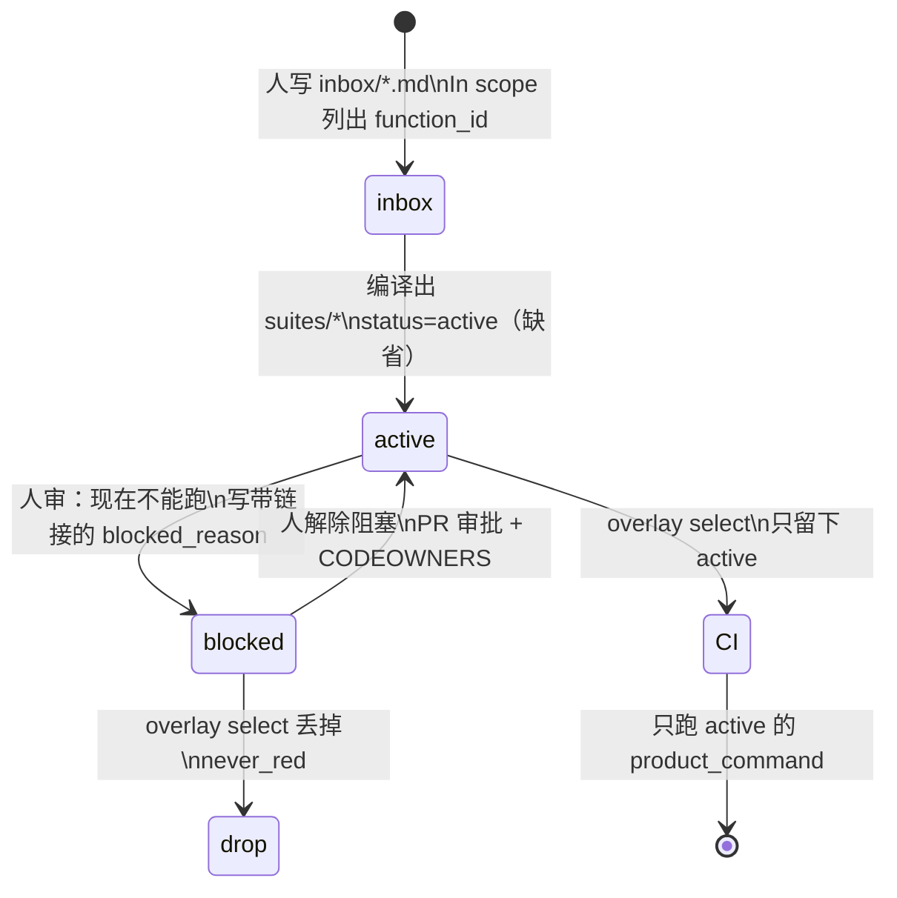
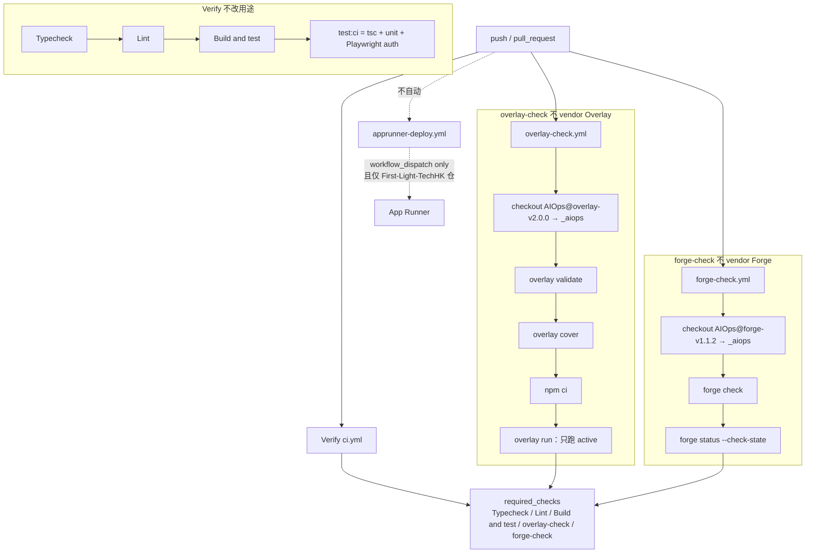
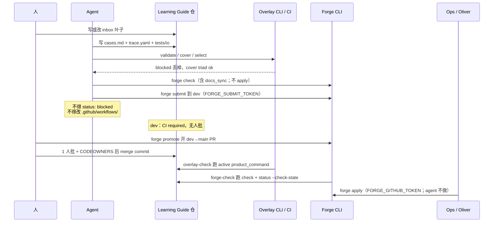

# Learning Guide × Overlay / Forge（开发群说明）

发群请直接丢这一份。GitHub 打开可看图；微信 / 飞书不渲染 Mermaid，文里每张图都附了 ASCII。

**文件：** `docs/phase1/overlay-forge-brief.md`  
**入口：** [`AGENTS.md`](../../AGENTS.md) 第 6 条  
**现状：** [`docs/STATE.md`](../STATE.md)（`forge status` 生成，不要手改）  
**登记：** [`overlay-forge-issues.md`](./overlay-forge-issues.md)

这不是 KS。产品仓是 `LibertychaserUS/LearningGuidePortal`。工具仓是 `LibertychaserUS/AIOps`。发布针只认已发布 tag：`overlay-v2.0.0`（Overlay）/ `forge-v1.1.2`（Forge）；同一仓、两件产品。不要 pin `main`。不要手抄 SHA。

---

## 0. 三十秒读完

1. **Forge** 管谁能推、谁开 PR、哪些路径不能改、哪些 **CI job 名**必须绿。不合入。开发侧 `check` → PR 到 `dev`；Ops 用 `promote` 开 `dev`→`main` PR。
2. **Overlay** 管需求叶子 → 可审用例。CI 跑 **`active`**。**`blocked`** 丢掉、不当红，且 `blocked_reason` 必须含链接或登记编号。人审走 PR 审批 + CODEOWNERS。
3. Learning Guide 只接薄文件，**不 vendor** `overlay/` 或 `forge/`。
4. **Verify 用途不变**：Typecheck → Lint → Build and test（`test:ci` = tsc + unit + Playwright auth）。不把 `test:io` 塞进 Verify。
5. overlay-check 是原生 `overlay validate` + `cover` + `run`。只跑 **`active`**。`blocked` 丢掉、不当红。login / payment / portal / my-learning 现为 `active`。不要再接 `overlay-run-existing.py` 硬跑。
6. 人审是 GitHub PR 审批 + CODEOWNERS，不是 yaml 签名。Agent **不得** 把套件改成 `blocked`（`suite_guard`），**不得** 改 `.github/workflows/`（`deny_paths`）。`docs_sync` 在本地 `forge check` 和 CI `forge-check` 都会跑。任何人 **不得** 打 `ilovelearningguide.com`。
7. 支付 hop / 断网 / 页面如何追上 `paid`：[`payment-state-propagation.md`](./payment-state-propagation.md)。
8. **Agent 交互：** Forge 是开发后 GitHub 落地（`check` → PR 到 `dev` → `promote` 到 `main`），不是测试工具。本仓已有 `forge.yaml` 时问一次；同意后默认跑 `check`，持有 `FORGE_SUBMIT_TOKEN` 再 `submit` 到 `dev`，不要每次存盘再讲宪法。初始化同意 ≠ live-apply。`FORGE_SUBMIT_TOKEN` 与 `FORGE_GITHUB_TOKEN` 是 Oliver 提供的环境密钥，agent 永不粘贴 token。接入方若还没有 Forge、且已有自己的落地方式，先对照新旧并等人明确同意，不能默默替换。

---

## 1. 为什么要接这两件，而不是再写一套 CI

旧 AUTH / PAY 锁是白盒 TDD，直接进 `productStore`。`main` 上 `6d8934e` 已经把那些锁撤掉了，只留 My Learning。

现在改成：

| 层 | 放什么 | 谁改 |
|---|---|---|
| `inbox/*.md` | 需求叶子，ID 沿用历史 `AUTH-01..06` / `PAY-01..10` | 人写意图，Agent 可补 |
| `suites/*/cases.md` + `trace.yaml` | 可审规格：每片叶子 Functional / Negative / Edge | Agent 写，人审 |
| `tests/io/*.test.ts` | 黑盒：HTTP 进，状态码 + 公开 JSON 出 | Agent 写 |
| Overlay CI | `overlay-check` 跑本仓 `product_command`。`overlay select` 只入选 `active` | 不要空转假绿 |
| Verify | 产品原有门禁，不改用途 | 不要往里塞 Overlay / e2e / k6 |

不另开一套 ID。不把 workshop 的 `pr-title` / `sop-lock` 抄进产品仓。

---

## 2. 两件工具各管一段

```text
Forge
  谁能推、谁开 PR、保护哪些分支（dev / main）
  deny 哪些路径（.github/workflows/ 整目录）
  required checks 叫什么（CI job 名）
  本地：forge check → forge submit 到 protect[0]=dev（要 FORGE_SUBMIT_TOKEN）
  forge promote 开 dev→main PR（永不 merge）
  Ops 才 apply GitHub Rulesets（FORGE_GITHUB_TOKEN）；Forge 自己不 merge
  docs_sync 在 check 与 CI forge-check 都跑

Overlay
  需求叶子 → 可审用例 → CI 只跑 active
  状态：active | blocked（缺省 = active）
  blocked 必须带链接的 blocked_reason
  never_red_statuses: blocked
  人审 = PR 审批 + CODEOWNERS
```

产品仓只接这些薄文件（不要 vendor 工具源码）：

- `forge.yaml`
- `overlay.yaml`
- `inbox/*`
- `suites/*`
- `invariants.yaml`
- `.github/CODEOWNERS`
- `.github/workflows/overlay-check.yml`（job 名必须叫 `overlay-check`；checkout `AIOps@overlay-v2.0.0` 到 `_aiops`，不 vendor `overlay/`）
- `.github/workflows/forge-check.yml`（job 名必须叫 `forge-check`；checkout `AIOps@forge-v1.1.2` 到 `_aiops`）
- `docs/STATE.md`（生成；不要手改）

---

## 3. 套件状态机

人写 inbox → 编译成 `active` 套件（缺省）。未就绪的隔离成 `blocked`，且 `blocked_reason` 必须含链接或登记编号（`http(s)://…` / `OF-12` / `#123`）。原生 `overlay select` / `overlay run` 只执行 `active`。`blocked` 进 `never_red_statuses`：不跑、不当红。人审证据在 GitHub PR 审批 + CODEOWNERS，不在 yaml。Agent 分支不得把套件改成 `blocked`（`suite_guard`）。不要硬跑。



ASCII：

```text
[*] → inbox ──编译──► active ──select──► overlay run → receipt
                 │              ▲
                 └──blocked─────┘
                      │
                      └──select 丢掉──► never red

规则
  never_red = blocked
  blocked_reason 必须含链接或登记编号
  人审 = PR 审批 + CODEOWNERS（不是 yaml 签名）
  不要 overlay-run-existing.py
  product_command 指向 tests/io 或 unit
  overlay-check = overlay validate + cover + run
```

---

## 4. 产品仓 CI DAG

push / PR 同时走三条线：左边 Verify 不改用途；中间 overlay-check 拉 `overlay-v2.0.0`；右边 forge-check 拉 `forge-v1.1.2`。都不把工具仓拷进产品树。deploy 不自动。A 路线：功能 PR 打 `dev`（CI required，无人批）；`dev → main` 的 promote PR 要 1 人批 + CODEOWNERS。



ASCII：

```text
                         push / pull_request
                    /            |              \
                   /             |               \
          Verify ci.yml    overlay-check.yml    forge-check.yml
          Typecheck        checkout AIOps@overlay-v2.0.0 → _aiops
             ↓                validate + cover
           Lint                  npm ci
             ↓                overlay run（active）
      Build and test                 │
             ↓                       │
   test:ci = tsc+unit          job 名 overlay-check
   + Playwright auth                 │
                    \                │
                     \               │         checkout AIOps@forge-v1.1.2 → _aiops
                      \              │            forge check
                       \             │            forge status --check-state
                        \            │                 │
                         → required_checks ←─────────────┘
                           Typecheck / Lint / Build and test
                           / overlay-check / forge-check

apprunner-deploy.yml ──不自动──► App Runner
  仅 workflow_dispatch，且仅 First-Light-TechHK 仓

分支
  agent PR → dev     CI required，approvals=0
  forge promote       开 dev→main PR
  main               CI required，approvals=1 + CODEOWNERS，merge commit
```

不要做的：

- 不要把 workshop `ci.yml` 的 pr-title / sop-lock 抄进 Learning Guide。
- 不要把 e2e / k6 / 生产冒烟加进 Verify。
- 不要自动 App Runner。
- 不要打 `ilovelearningguide.com`。
- 不要改 `.github/workflows/`（`deny_paths`；本轮针脚由人授权提交）。

---

## 5. 人、Agent、CI 怎么配合



ASCII：

```text
人                Agent              产品仓              Overlay           Forge
│                  │                  │                  │                 │
│──写/改 inbox────►│                  │                  │                 │
│                  │──cases/trace/io─►│                  │                 │
│                  │──validate/cover/select───────────────►│                 │
│                  │◄── blocked 丢掉，triad ok ──────────│                 │
│                  │──forge check（docs_sync；不 apply）──────────────────►│
│                  │──submit 到 dev（FORGE_SUBMIT_TOKEN）─────────────────►│
│                  │   ✗ status:blocked │               │                 │
│                  │   ✗ .github/workflows/ │            │                 │
│                  │                  │── overlay-check / forge-check ──►│
│──promote 开 PR ─────────────────────────────────────────────────────────►│
│──1 人批 + CODEOWNERS，merge commit 进 main──►│             │                 │
│                  │                  │◄── run active ───│                 │
Ops（Oliver）──forge apply（FORGE_GITHUB_TOKEN；agent 永不做）─────────────►│
```

分工一口说清：

| 角色 | 可以 | 不可以 |
|---|---|---|
| Agent | 写 inbox / cases / trace / 产品 HTTP 修复 / `tests/io`；跑 validate、cover、select、`test:io`、`forge check`；`submit` 到 `dev` | 把套件改成 `blocked`；改 `.github/workflows/`；live-apply；自批 / 自合；粘贴 token；打生产站 |
| 人（开发 / 审套件） | 读 cases；合进 `dev`；批 promote PR；手写 `blocked` + 带链接的 `blocked_reason` | 让 Agent 代改 `blocked`、代 apply、代批 |
| Ops / Oliver | `forge apply`（`FORGE_GITHUB_TOKEN`，fork 的 `dev`+`main`）；批 promote PR；点 AIOps `release` workflow | 把密钥交给 agent 粘贴 |
| CI overlay-check | validate + cover + 跑 `active` 的 `product_command` | 空转假绿；把 `blocked` 当红 |
| CI forge-check | `forge check` + `status --check-state` | live-apply；merge |
| CI Verify | Typecheck / Lint / `test:ci` | 跑 `test:io`、e2e、k6、生产冒烟 |

---

## 6. 本仓当前针脚

生成出来的现状（pin、保护分支、Ruleset、CI job 名、promote PR）**只看** [`docs/STATE.md`](../STATE.md)，不要在本文件手抄。薄文件如下：

| 文件 | 现在是什么 |
|---|---|
| `forge.yaml` | `protect: [dev, main]`；`deny_paths: .github/workflows/`；`branches.dev` approvals=0；`branches.main` approvals=1、CODEOWNERS、`promote_from: dev`；required_checks = Typecheck、Lint、Build and test、overlay-check、forge-check；`docs_sync`；`title.scopes: any` |
| `overlay.yaml` | `product.repo: LibertychaserUS/LearningGuidePortal`；`default_ref` 钉在 `d06d15abaaefd001141dbe6a739362f2aefca3b4`；`branches` 含 `dev` / `main` / `default`；`never_red_statuses: [blocked]`；`forbid_hosts: ilovelearningguide.com` |
| `inbox/login.md` | AUTH-01..06 |
| `inbox/payment.md` | PAY-01..10 |
| `inbox/portal.md` `inbox/my-learning.md` | 已有叶子；套件 `active` |
| `suites/login` `suites/payment` `suites/portal` `suites/my-learning` | `schema: overlay-suite/v2`，`status: active`。login/payment → `tests/io/*.test.ts` |
| `invariants.yaml` | `INV-unauth-no-grant`（AUTH-06, PAY-01/02/08）；`INV-browser-not-price`（PAY-01/03/09）；`INV-one-charge`（PAY-04/05/10） |
| `.github/CODEOWNERS` | `suites/**`、`inbox/**`、`.github/workflows/**`、入口文档归 `@LibertychaserUS` |
| `.github/workflows/overlay-check.yml` | 单 job `overlay-check`：checkout `AIOps@overlay-v2.0.0` → `_aiops`、`npm ci`、`overlay validate` + `cover` + `run` |
| `.github/workflows/forge-check.yml` | 单 job `forge-check`：checkout `AIOps@forge-v1.1.2` → `_aiops`、`forge check` + `forge status --check-state`。`1.1.2` 把 push 上的空 `PR_TITLE` 当成已提供标题。规格在未发布的 `forge-1.1.3`（事件 × 来源，push 锁提交 subject），不是把变量从 push 拿掉（OF-22）。本仓针未升前 workflow 仍拆了该变量；agent 不改 `deny_paths` 里的工作流 |
| `docs/STATE.md` | 生成；不要手改 |
| `tests/io/*` | 黑盒，本地 `npm run test:io`。**不在** `test:ci` 里 |

官方针：`overlay-v2.0.0` / `forge-v1.1.2`。不要 pin `AIOps` 的 `main`。不要 force-move 旧针。两份 workflow 都在 `deny_paths` 里，agent 不改。历史 lander 见 [`aiops-release/APPLY.md`](./aiops-release/APPLY.md)。

---

## 7. AUTH / PAY 缺陷一条一条

编号沿用历史叶子，不另开一套。状态三个词：

- **已锁**：公开 HTTP 输入/输出能证明正确行为。
- **半锁**：公开 API 只能锁近似面，完整不变式还要 Stripe / 表 / 内部行。
- **难做纯黑盒**：没有稳定 HTTP 面，或必须读 `productStore` / 打真 Stripe。

对照：

- 可执行黑盒：`tests/io/login.test.ts`、`tests/io/payment.test.ts`、`tests/io/portal.test.ts`、`tests/io/visitor-trial.test.ts`
- 服务层：`tests/unit/pay-invariants.test.ts`、`tests/unit/pay-stripe-fake.test.ts`（假 Stripe，不打真网）
- Overlay 规格：`suites/login/cases.md`、`suites/payment/cases.md`（`active`）

### AUTH

#### 1. AUTH-01 邮箱枚举 — 已锁

- **当时**：`POST /api/auth/check-email` 返回 `exists`。已注册地址再注册，JSON 带 `already exists`。pending 登录单独 403 `EMAIL_NOT_VERIFIED`。pending 重发单独 429，未知邮箱却是 200。
- **现在要求**：已知和未知邮箱同一 HTTP 状态、同一公开 JSON 形（可去掉 `requestId`）。没有 `exists`。登录统一 401 `AUTHENTICATION_FAILED`。重发统一 200，不因 pending 单独限流。
- **黑盒**：能做。造 pending 用户时本地 `EMAIL_DELIVERY=discard`，不发真邮件。

#### 2. AUTH-02 重置链接泄漏 — 已锁

- **当时**：非生产环境 `POST /api/auth/password-reset/request` 的 JSON 带 `resetUrl` 或裸 token。
- **现在要求**：已知和未知邮箱都是 `{ ok: true }`。正文没有 `resetUrl`、`token`、`token=`。
- **黑盒**：能做。直接比两封邮件的响应。

#### 3. AUTH-03 `APP_ENV=PRODUCTION` 不算生产 — 已锁

- **当时**：`isProductionEnvironment()` 只认 `PROD` / `PPE/PROD`。`APP_ENV=PRODUCTION` 时本地社交会话和 resetUrl 仍开。
- **现在要求**：PRODUCTION 下未配邮件的 reset → 503 且无 URL。`LOCAL_SOCIAL_LOGIN=1` 时 Google 本地会话 → 503、不发 cookie。
- **黑盒**：能做，但要临时改环境。`NEXT_PUBLIC_APP_URL` 必须是 `https://localhost`，否则 origin 检查会先 303。

#### 4. AUTH-04 环境邮箱提权 Operator — 注册已锁，Google 建号难做纯黑盒

- **当时**：注册或 Google 建号时，邮箱等于 `BACKOFFICE_OPERATOR_EMAIL` 就写成 `operator`。`isOperator()` 再按环境邮箱现场提权，学生也能进 Backoffice。
- **现在要求**：该邮箱注册后 `/api/auth/me` 仍是 student。`GET /api/backoffice/courses` 为 403。后来再把环境变量改成这个邮箱，也不提权。
- **黑盒**：注册路径能做。Google 建号要真 OAuth 或固定本地画像，无 OAuth 时走不到。

#### 5. AUTH-05 pending 覆盖密码 / 并发同邮箱 — 同进程已锁，跨进程难做纯黑盒

- **当时**：pending 用户再次 `registerUser` 会覆盖 `passwordHash`（后写接管）。两个进程同时注册同一新邮箱，可能两个用户或后写覆盖。
- **现在要求**：第二次注册不接管第一个密码。并发之后只有一个密码能登录，只有一个用户。
- **黑盒**：同进程两次 POST 能锁「后写不接管」。跨进程竞态旧锁用 worker 进 `productStore`；现在 `editData` 在同进程里排队，证明不了文件锁。

#### 6. AUTH-06 会话不踢 — 已锁

- **当时**：`createSession` 不删该用户其它会话。资料页改密不失效其它会话（重置密码会清，改密不会）。
- **现在要求**：第二次登录后，第一枚 cookie 的 `/api/auth/me` 为 `user: null`。PATCH 改密后原会话不能再 quote。
- **黑盒**：能做。

### PAY

#### 7. PAY-01 `$0` trial 的 `invoice.paid` 升成整段付费 — 服务层已锁，HTTP 仍半锁

- **当时**：试用订阅收到金额为 0 的 `invoice.paid` 时，`convertStripeTrial` 写成整段付费购买，`validTo` 跳到约 6 个月。
- **现在要求**：`$0` 不得转换。试用仍是 trial，到期落在 3 天窗口内，不能出现 purchase 订阅。
- **黑盒**：HTTP 仍难（要真 Stripe trialing invoice）。服务层已锁：`pay-invariants` / `pay-stripe-fake` 对 `$0` `invoice.paid` 不转正。

#### 8. PAY-02 升级只过期本地行，不 cancel Stripe — 半锁

- **当时**：升级履约只把源订阅标 expired，不向 Stripe 发 cancel。源 Stripe 订阅继续自动扣。
- **现在要求**：必须对源 `stripeSubscriptionId` 发出 cancel。本地过期不是证明。
- **黑盒**：难。HTTP 看不到 `stripeCancelIssued`。可执行的只是「没有源订阅的 upgrade quote → 400」。

#### 9. PAY-03 同一 quote 两张可付 Session — 服务层已锁，HTTP 仍半锁

- **当时**：同一 quote 再次 checkout 会 `sessions.create` 第二张可付 Stripe Session。只保住本地第一张 session id 不够。
- **现在要求**：复用第一张 Session，不得再 create。
- **黑盒**：HTTP 仍难。服务层已锁：假 Stripe 第二次 checkout 不再 `sessions.create`。

#### 10. PAY-04 退款后 `invoice.paid` 复活 — 半锁

- **当时**：退款后 entitlement 不立刻死。随后同一订阅的 `invoice.paid` 会把购买救活。
- **现在要求**：退款立即 `revoked` / 不允许。后到的 invoice 不得再授权。
- **黑盒**：难。没有 operator 退款的稳定 HTTP，也没有「已履约再投 invoice」的公开面。未支付 / 孤儿 paid webhook 只证明「没有订单就不授权」。

#### 11. PAY-05 重复事件履约两次，无表 UNIQUE — 半锁

- **当时**：同一成功事件处理两次会履约两次。`product.json` 的 `stripeEvents[]` 不是表级 UNIQUE。
- **现在要求**：`stripe_events` 要有 UNIQUE。第二次是 duplicate，active entitlement 仍只有一行。
- **黑盒**：难。HTTP 没有 entitlement 行列表。demo 对同一 order 两次 complete、同一 signed `ping` 两次 `ignored`，都不是 UNIQUE 证明。

#### 12. PAY-06 grace 锚在 now+3 天 — 服务层已锁，HTTP 仍半锁

- **当时**：`invoice.payment_failed` 把 `validTo` / `graceEndsAt` 写成现在 +3 天，而不是原到期日 +3 天。已付期限会被缩短。
- **现在要求**：`graceEndsAt = 原 validTo + 3 天`。已付 `validTo` 不得缩短。
- **黑盒**：公开 API 仍不返回 `graceEndsAt`。服务层已锁：`graceEndsAt = 原 validTo + 3d`，已付期限不缩短。

#### 13. PAY-07 `invoice.paid` 清掉 cancel_at_period_end — 服务层已锁，HTTP 仍半锁

- **当时**：用户已 cancel-at-period-end 后，续费成功的 `invoice.paid` 把取消标志清掉，resume 又可用。
- **现在要求**：invoice 之后仍是 `cancel_at_period_end`。付费购买不得 resume。
- **黑盒**：demo 取消后 resume → 400 仍锁本地路径。服务层已锁：`invoice.paid` 不再清 `cancelAtPeriodEnd`。

#### 14. PAY-08 重叠购买删掉上一行 entitlement — 服务层已锁，HTTP 仍半锁

- **当时**：重叠授权时用 `filter()` 删掉上一行 active entitlement，而不是标 `expired`。审计行消失。
- **现在要求**：旧行保留且 `state=expired`。当前仍只有一行 active。
- **黑盒**：HTTP 仍看不到 entitlement 行列表。服务层已锁：`expireOverlappingActiveEntitlements` 标 expired，不删行。

#### 15. PAY-09 PC 授权忽略设备和重复购买 — 已锁

- **当时**：`checkEntitlement(userId, courseId)` 不看 device。PC 购买后 mobile 检查也 allowed。有效期内还能再 quote 同一 plan。
- **现在要求**：`device=pc` 允许，`device=mobile` 不允许。再 quote 同 plan → 400 `already has active access`。
- **黑盒**：能做。check 增加了可选 `device` 查询参数，否则 HTTP 看不见设备带。

#### 16. PAY-10 取消试用后再 complete 复活 — 已锁

- **当时**：demo trial 已 paid 且已取消后，再 `completeDemoTrialOrder` 会把 entitlement 救活。
- **现在要求**：第二次 complete → 400。entitlement 仍 false。
- **黑盒**：能做。trial → confirm → subscription cancel → 再 confirm。

---

## 8. 很难做纯黑盒的（单独列给审套件的人）

旧 TDD 是直接调 `productStore` 或断言内部字段。公开 HTTP 锁不全的是这些：

1. **AUTH-04 的 Google 建号提权。** 无真 OAuth 时到不了 `getOrCreateSocialUser` 的 Google 分支。本地 Google 画像邮箱是固定的 `google.local@example.test`，和测试用的 operator 邮箱不是同一条路径。
2. **AUTH-05 跨进程并发。** 同进程两次 POST 会被 `editData` 排队。要证明文件锁，必须两个进程写同一份 `product.json`。那就要 worker，不再是纯 HTTP。
3. **PAY-01 真 `$0 invoice.paid`。** 服务层已用假 Stripe 锁住「`$0` 不转正」。真 Stripe trialing invoice 仍无 HTTP 面。
4. **PAY-02 源订阅 Stripe cancel。** 正确证明是 Stripe 侧 cancel 已发出。本地行 `expired` 正好是当时的假绿。
5. **PAY-03 第二张 Stripe Session。** 服务层假 Stripe 已锁「第二次 checkout 不再 create」。真 Stripe 侧仍无 HTTP 面。
6. **PAY-04 退款后 invoice 复活。** 要 operator 退款（或 Stripe refund）再投 `invoice.paid`。本仓没有这条稳定 HTTP。
7. **PAY-05 `stripe_events` 表 UNIQUE。** JSON 数组或进程内 claim 都不是 UNIQUE。没有库表，HTTP 也看不到第二行 entitlement。
8. **PAY-06 grace 锚点。** 服务层已锁 `graceEndsAt = 原 validTo + 3d`。公开 JSON 仍没有这两个字段。
9. **PAY-07 invoice 清 cancel 标志。** 服务层已锁 invoice 不清 `cancelAtPeriodEnd`。demo 的 resume 400 仍是 HTTP 近似面。
10. **PAY-08 Stripe resync 删行。** 服务层已改为标 expired。公开 HTTP 仍看不到 entitlement 行列表。

为什么锁不住：

1. 浏览器进不了 Stripe 真路径。本仓 I/O 只打 webhook 验签 / 未匹配 / 忽略，以及 demo 的 quote、checkout、confirm、trial、subscription。
2. 没有 entitlement 审计列表 API。check 只返回当前是否允许。
3. 没有 operator 退款 HTTP。
4. 并发要跨进程，同进程队列会把竞态藏起来。
5. 黑盒不能 import `productStore` 去读 `passwordHash`、`stripeCancelIssued`、`graceEndsAt`、`stripeEvents[]`。

PAY-01 / 03 / 06 / 07 / 08 的服务层锁已经进 `tests/unit/pay-invariants.test.ts`。不要假装 HTTP 已经锁死；不要为同一叶子再开一轮重复白盒。PAY-02（真 Stripe cancel）和 PAY-05（表级 UNIQUE）仍待定。

**Hop** 是链路里的一步，不是 Stripe 术语。支付主链是 `quote → checkout → Stripe → webhook → order.paid → entitlement → 进课`。当前 I/O 多半停在 quote / checkout / demo confirm。断网时用户 / 本站 / Stripe 怎么处理、成功状态怎么写入 store、其他页面怎么拉到新状态，见 [`payment-state-propagation.md`](./payment-state-propagation.md)。

---

## 9. 刻意没做的

1. 不把 `test:io` 加进 Verify 的 `test:ci`。
2. 不写已删除的 `armed` / `reviewed_by` 字段。Agent 不把套件改成 `blocked`。
3. 不打 `ilovelearningguide.com`。
4. 不把 workshop 的 `pr-title` / `sop-lock` 抄进 Learning Guide CI。
5. Agent 不 live-apply Forge Rulesets；apply 只由 Oliver 持 `FORGE_GITHUB_TOKEN` 做。
6. 不 vendor `overlay/` 或 `forge/`。
7. 不把上游 First-Light 的超前提交混进这支 Overlay PR。fork `main` 仍是 `6d8934e`。
8. 不为半锁叶子再发明第二套 ID。

---

## 10. 开发群接下来做什么

按这个顺序，不要跳：

1. **读 [`overlay-forge-issues.md`](./overlay-forge-issues.md) §F** 和 [`docs/STATE.md`](../STATE.md)，再看 `suites/login/cases.md`、`suites/payment/cases.md` 与 `tests/io`。
2. **功能 PR 打 `dev`。** `forge check` 绿之后 `submit`（或 host PR）到 `dev`。CI required，无人批。
3. **`dev → main` 只走 `forge promote`。** 1 人批 + CODEOWNERS，merge commit。人审证据在这次批准，不在 yaml。
4. **半锁叶子**先留在 cases 里。缺 Stripe / 表 / 审计 API 时由人写成 `blocked` + 带链接的 `blocked_reason`，不要为了绿去白盒内部字段。Agent 不得改成 `blocked`。
5. **Ruleset** 由 Oliver 跑 `forge apply`。agent 不做。密钥是环境变量，不进 git、不进聊天。
6. **Verify 保持原样。** 产品回归继续走 `test:ci`。

---

## 11. 本地命令

需要 CPython **3.12+**。先装工具仓，只 checkout **已存在的 tag**：

```text
git clone https://github.com/LibertychaserUS/AIOps.git /tmp/AIOps
cd /tmp/AIOps
git checkout overlay-v2.0.0
# Forge CLI：git checkout forge-v1.1.2（同一仓、另一件产品）
python3 -m pip install -r requirements.txt
export PYTHONPATH=/tmp/AIOps
# overlay-check 产品门里会再跑 npm ci；本地 I/O 用 npm run test:io。不要把 test:io 加进 Verify。
```

不要 pin `main`。不要 force-move 旧针。不要手抄 SHA。现状看 [`docs/STATE.md`](../STATE.md)。发布记录见 [`aiops-release/APPLY.md`](./aiops-release/APPLY.md)。

本仓 native skills（Codex / Cursor / Claude Code）：

| 标准路径 | Canonical |
|---|---|
| `.agents/skills/<name>` | `docs/phase1/skills/<name>/SKILL.md` |
| `.cursor/skills/<name>` | 同上（symlink） |
| `.claude/skills/<name>` | 同上（symlink） |

权威 skill 在工具仓：`https://github.com/LibertychaserUS/AIOps/blob/forge-v1.1.2/skills/<name>/SKILL.md`。本仓那五份是 Learning Guide 薄操作说明。`name` = `use-forge` / `use-overlay` / `design-cases` / `dev-pr` / `manage-repo`。`use-forge` 是开发冷启动（`check` → PR 到 `dev`）；live `apply` 只在 `manage-repo`，且只有 Oliver 做。本仓已有 `forge.yaml`：问一次，同意后默认跑 `check` / `submit` 到 `dev`。不要每次存盘再讲宪法。初始化同意 ≠ live-apply。

或从已发布 tag 装工作本（host id：`codex` / `cursor` / `claude-code` / `github-copilot`）：

```text
# overlay-v2.0.0 / forge-v1.1.2 — 官方针，见 docs/STATE.md
gh skill install LibertychaserUS/AIOps --agent cursor --pin overlay-v2.0.0 --all
gh skill install LibertychaserUS/AIOps use-forge --agent cursor --pin overlay-v2.0.0
gh skill install LibertychaserUS/AIOps use-overlay --agent cursor --pin overlay-v2.0.0
gh skill install LibertychaserUS/AIOps design-cases --agent cursor --pin overlay-v2.0.0
gh skill install LibertychaserUS/AIOps dev-pr --agent cursor --pin overlay-v2.0.0
gh skill install LibertychaserUS/AIOps manage-repo --agent cursor --pin overlay-v2.0.0
gh skill install . --from-local --all --allow-hidden-dirs --agent cursor
```

以本仓 skill / 本文件为准。未跟踪的 `/tmp` 套件、`## Specified`、缺 Edge 的叶子都不是产品真相。

```text
npm run test:io
PYTHONPATH=/tmp/AIOps python3 -m overlay validate --root .
PYTHONPATH=/tmp/AIOps python3 -m overlay cover --root .
PYTHONPATH=/tmp/AIOps python3 -m overlay select --root .
PYTHONPATH=/tmp/AIOps python3 -m overlay run --root . --workdir . --write-receipt /tmp/lg-receipts-run
PYTHONPATH=/tmp/AIOps python3 -m forge check --root . --title "feat: adopt Overlay 2.0.0 and Forge 1.1.2 with dev/main"
PYTHONPATH=/tmp/AIOps python3 -m forge status --root . --repo LibertychaserUS/LearningGuidePortal --check-state
```

`overlay select` 只留下 `active`；`--branch` 缺省：`GITHUB_BASE_REF` → `GITHUB_REF_NAME` → `main`，未知再回落 `branches.default`。overlay-check 必须真跑 `active` 的 `product_command`。不要 hard-run。

**历史：** 从 Overlay 1.0.x 升上来时曾用 `python -m overlay migrate --root .` 把 `draft`/`armed` 改成 `active` 并删掉 `reviewed_by`。现在套件已是 `overlay-suite/v2`，不要再迁一遍。

`python -m forge` 子命令以工具仓 [`docs/cli.md`](https://github.com/LibertychaserUS/AIOps/blob/forge-v1.1.2/docs/cli.md) 为准。开发侧用 `check` / `submit` / `promote`；Ops 才 `apply` / `release`。没有 `brief`、`credential`、`ops-chain`、`revoke`。缺 `FORGE_SUBMIT_TOKEN` 时 `submit` / `promote`（含 `--dry-run`）fail-closed，改走 host 的 PR 路径（见 `dev-pr`）。`required_checks` 是 job 名：`Typecheck` / `Lint` / `Build and test` / `overlay-check` / `forge-check`，不要抄 workflow 名 `Verify`。

叶子必须是 `### Functional` / `### Negative` / `### Edge`。不要 `### Depth`。不要 `## Specified / not tested now`。已有的 `overlay-check.yml` 是单 job `overlay-check`（checkout `AIOps@overlay-v2.0.0` 到 `_aiops`、`npm ci`、`overlay validate` + `cover` + `run`）；另有 `forge-check.yml`（checkout `AIOps@forge-v1.1.2`、`forge check` + `status --check-state`）。两者都在 `deny_paths` 里，agent 不改。Agent 不 live-apply、不把套件改成 `blocked`、不打 `ilovelearningguide.com`、不改 Verify、不把 `test:io` 塞进 `test:ci`。

`--branch` 只选 `overlay.yaml` 里 `branches.<name>` 那条策略；套件 `status` 读的是**当前 checkout**。已知问题与待 Oliver 的操作，集中记在 [`overlay-forge-issues.md`](./overlay-forge-issues.md)。
