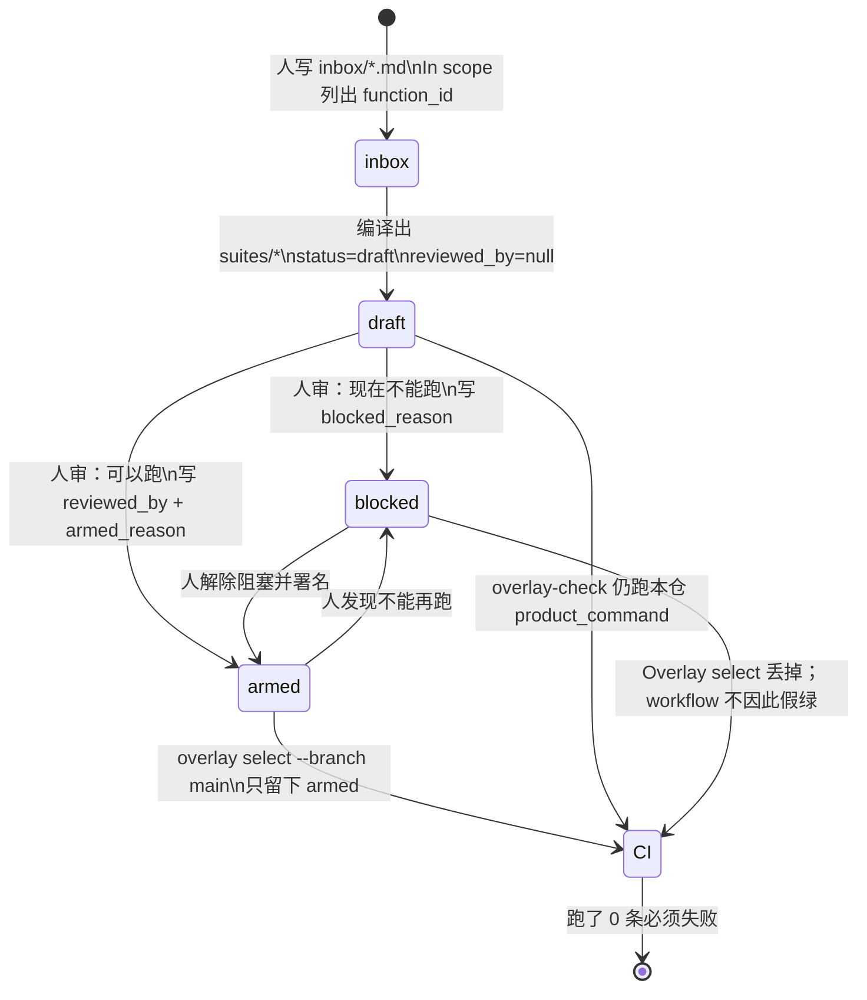
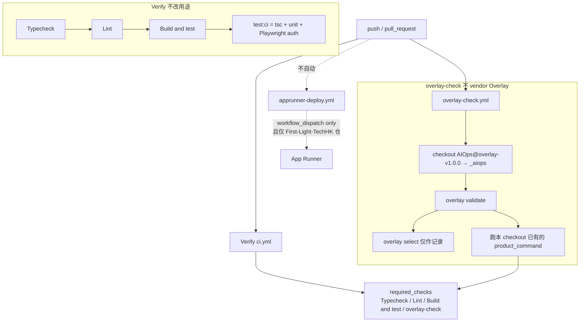
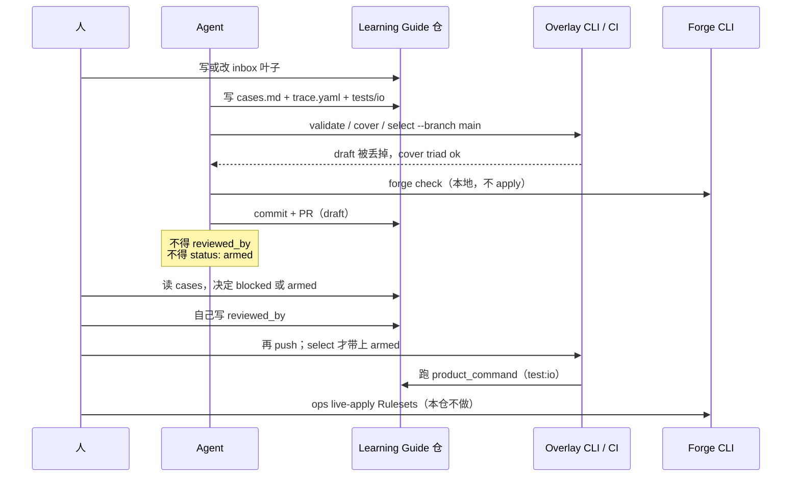

# Learning Guide × Overlay / Forge（开发群说明）

发群请直接丢这一份。GitHub 打开可看图；微信 / 飞书不渲染 Mermaid，文里每张图都附了 ASCII。

**文件：** `docs/phase1/overlay-forge-brief.md`  
**PR：** https://github.com/LibertychaserUS/LearningGuidePortal/pull/2  
**基线：** `cursor/local-forge-overlay-2e0c` → 这支是 `cursor/io-login-payment-overlay-2e0c`

这不是 KS。产品仓是 `LibertychaserUS/LearningGuidePortal`。工具仓是 `LibertychaserUS/AIOps`。发布针只认 tag：`overlay-v1.0.0` / `forge-v1.0.0`（同一 SHA `235e514…`），不认 `main`。

---

## 0. 三十秒读完

1. **Forge** 管谁能推、谁开 PR、哪些路径不能改、required checks 叫什么。
2. **Overlay** 管需求叶子 → 可审用例 → CI 只跑人签过名的 `armed` 套件。
3. Learning Guide 只接薄文件，**不 vendor** `overlay/` 或 `forge/`。
4. **Verify 用途不变**：Typecheck → Lint → Build and test（`test:ci` = tsc + unit + Playwright auth）。不把 `test:io` 塞进 Verify。
5. 登录 / 支付套件仍是 **`draft` + `reviewed_by: null`**。`overlay select` 仍会丢掉它们。**overlay-check 不再靠这次 select 假装过关**：workflow 在 runner 里拉 `overlay-v1.0.0`，校验现有目录，然后执行本 checkout 上已经存在的 `product_command`。人没 arm 之前，那也不是 Overlay-armed。
6. Agent **不得** 写 `reviewed_by`，**不得** 把 `status` 写成 `armed`。Ops **不得** 对本仓 live-apply Rulesets。任何人 **不得** 打 `ilovelearningguide.com`。
7. 支付 hop / 断网 / 页面如何追上 `paid`：[`payment-state-propagation.md`](./payment-state-propagation.md)。

---

## 1. 为什么要接这两件，而不是再写一套 CI

旧 AUTH / PAY 锁是白盒 TDD，直接进 `productStore`。`main` 上 `6d8934e` 已经把那些锁撤掉了，只留 My Learning。

现在改成：

| 层 | 放什么 | 谁改 |
|---|---|---|
| `inbox/*.md` | 需求叶子，ID 沿用历史 `AUTH-01..06` / `PAY-01..10` | 人写意图，Agent 可补 |
| `suites/*/cases.md` + `trace.yaml` | 可审规格：每片叶子 Functional / Negative / Edge | Agent 写，人审 |
| `tests/io/*.test.ts` | 黑盒：HTTP 进，状态码 + 公开 JSON 出 | Agent 写 |
| Overlay CI | `overlay-check` 跑本仓 `product_command`。`overlay select` 仍只认 armed，不当这道门禁 | 空转假绿 |
| Verify | 产品原有门禁，不改用途 | 不要往里塞 Overlay / e2e / k6 |

不另开一套 ID。不把 workshop 的 `pr-title` / `sop-lock` 抄进产品仓。

---

## 2. 两件工具各管一段

```text
Forge
  谁能推、谁开 PR、保护哪些分支
  deny 哪些路径（ci.yml / apprunner-deploy.yml / overlay-check.yml）
  required checks 叫什么
  本地：forge check → forge submit（要 FORGE_SUBMIT_TOKEN）
  Ops 才 apply GitHub Rulesets；Forge 自己不 merge

Overlay
  需求叶子 → 可审用例 → CI 只跑 armed
  状态：draft | blocked | armed
  1.0.0 不带 generate
  人审之前套件必须是 draft 或 blocked
  never_red_statuses: draft, blocked
```

产品仓只接这些薄文件：

- `forge.yaml`
- `overlay.yaml`
- `inbox/*`
- `suites/*`
- `invariants.yaml`
- `.github/workflows/overlay-check.yml`（职务名必须叫 `overlay-check`；workflow 内 checkout `overlay-v1.0.0`，不 vendor `overlay/`）

---

## 3. 套件状态机

人写 inbox → 编译成 draft 套件 → 人决定 blocked 或 armed。`overlay select` 仍丢掉 draft / blocked。**overlay-check 另外**在 workflow 里跑本 checkout 已有的 `product_command`；跑了 0 条必须失败。



ASCII：

```text
[*] → inbox ──编译──► draft ──人审──► armed ──select──► CI run → receipt
                 │              ▲
                 └──blocked─────┘
                      │
                      └──select 丢掉──► 不当 overlay-check 假绿

规则
  never_red = draft, blocked （只约束 overlay select）
  Agent 可写 inbox / cases / trace / tests/io
  Agent 不能填 reviewed_by，不能把 status 写成 armed
  product_command 指向 tests/io/*.test.ts
  overlay-check 跑本仓这条命令，不靠 select=0 过关
```

---

## 4. 产品仓 CI DAG

push / PR 同时走两条线：左边 Verify 不改用途；右边 overlay-check 在 runner 里拉 `overlay-v1.0.0`，不把工具仓拷进产品树。deploy 不自动。



ASCII：

```text
                    push / pull_request
                     /              \
                    /                \
            Verify ci.yml          overlay-check.yml
            Typecheck              checkout AIOps@overlay-v1.0.0 → _aiops
               ↓                      validate
             Lint                        ↓
               ↓                   跑本 checkout 已有的 product_command
        Build and test              （select 只记录；draft 不是 armed）
               ↓                         ↓
     test:ci = tsc+unit          职务名 overlay-check
     + Playwright auth                   │
                    \                    │
                     \                   │
                      → required_checks ←
                        Typecheck / Lint / Build and test / overlay-check

apprunner-deploy.yml ──不自动──► App Runner
  仅 workflow_dispatch，且仅 First-Light-TechHK 仓
```

不要做的：

- 不要把 workshop `ci.yml` 的 pr-title / sop-lock 抄进 Learning Guide。
- 不要把 e2e / k6 / 生产冒烟加进 Verify。
- 不要自动 App Runner。
- 不要打 `ilovelearningguide.com`。

workflow 按 Overlay 的 `## function_id` 自动发现本仓测试：`tests/io/<suite-id>.test.ts` / `tests/io/<id>-*.test.ts` / `tests/unit/<id>-*.test.ts`。规则在 `.github/scripts/overlay-run-existing.py`，不改 Overlay 1.0.0。不扫 e2e / integration，不把它们塞进 Verify。

---

## 5. 人、Agent、CI 怎么配合



ASCII：

```text
人                Agent              产品仓              Overlay           Forge
│                  │                  │                  │                 │
│──写/改 inbox────►│                  │                  │                 │
│                  │──cases/trace/io─►│                  │                 │
│                  │──validate/cover/select --branch main──►│             │
│                  │◄── draft 丢掉，triad ok ─────────────│                 │
│                  │──forge check（不 apply）─────────────────────────────►│
│                  │──commit + draft PR─►│               │                 │
│                  │   ✗ reviewed_by    │               │                 │
│                  │   ✗ status:armed   │               │                 │
│──读 cases────────►│                  │                  │                 │
│──自己写 reviewed_by + armed/blocked─►│                 │                 │
│──再 push──────────────────────────────────────────────►│                 │
│                  │                  │◄── run test:io ──│                 │
│──ops live-apply Rulesets（本仓不做）──────────────────────────────────►│
```

分工一口说清：

| 角色 | 可以 | 不可以 |
|---|---|---|
| Agent | 写 inbox / cases / trace / 产品 HTTP 修复 / `tests/io`；跑 validate、cover、select、`test:io`、`forge check`；开 draft PR | 填 `reviewed_by`；把套件标 `armed`；改 Verify 用途；vendor 工具仓；打生产站 |
| 人（开发 / 审套件） | 读 cases；决定 `blocked` 或 `armed`；自己署名 `reviewed_by` | 让 Agent 代签 |
| Ops | 需要时 live-apply Forge Rulesets | 对本仓现在不要 apply |
| CI Overlay | validate + 跑本仓 product_command | 空转假绿；select=0 当过关 |
| CI Verify | Typecheck / Lint / `test:ci` | 跑 `test:io`、e2e、k6、生产冒烟 |

---

## 6. 本仓当前针脚

| 文件 | 现在是什么 |
|---|---|
| `forge.yaml` | 保护 `main`；deny `ci.yml` / `apprunner-deploy.yml` / `overlay-check.yml`；required_checks = Typecheck、Lint、Build and test、overlay-check；`code_owners: false` |
| `overlay.yaml` | `product.repo: LibertychaserUS/LearningGuidePortal`；`default_ref` 钉在 `6d8934e5811e371554a94aa47b2f56c40bf0cbd3`；`forbid_hosts: ilovelearningguide.com` |
| `inbox/login.md` | AUTH-01..06 |
| `inbox/payment.md` | PAY-01..10 |
| `inbox/portal.md` `inbox/my-learning.md` | 已有叶子，套件同样 draft |
| `suites/login` `suites/payment` | `status: draft`，`reviewed_by: null`；`product_command` → `tests/io/login.test.ts` / `payment.test.ts` |
| `invariants.yaml` | `INV-unauth-no-grant`（AUTH-06, PAY-01/02/08）；`INV-browser-not-price`（PAY-01/03/09）；`INV-one-charge`（PAY-04/05/10） |
| `.github/workflows/overlay-check.yml` | runner checkout `LibertychaserUS/AIOps@overlay-v1.0.0` → `_aiops`，validate 后跑已有 `product_command`。不 vendor `overlay/` |
| `tests/io/*` | 49 条黑盒，本地 `npm run test:io` 绿。**不在** `test:ci` 里 |

发布针：`overlay-v1.0.0` / `forge-v1.0.0` = `235e514…`。不要 pin `AIOps` 的 `main`。

---

## 7. AUTH / PAY 缺陷一条一条

编号沿用历史叶子，不另开一套。状态三个词：

- **已锁**：公开 HTTP 输入/输出能证明正确行为。
- **半锁**：公开 API 只能锁近似面，完整不变式还要 Stripe / 表 / 内部行。
- **难做纯黑盒**：没有稳定 HTTP 面，或必须读 `productStore` / 打真 Stripe。

对照：

- 可执行黑盒：`tests/io/login.test.ts`、`tests/io/payment.test.ts`
- Overlay 规格：`suites/login/cases.md`、`suites/payment/cases.md`（仍是 draft）

### AUTH

#### 1. AUTH-01 邮箱枚举 — 已锁

- **当时**：`POST /api/auth/check-email` 返回 `exists`。已注册地址再注册，JSON 带 `already exists`。pending 登录单独 403 `EMAIL_NOT_VERIFIED`。pending 重发单独 429，未知邮箱却是 200。
- **现在要求**：已知和未知邮箱同一 HTTP 状态、同一公开 JSON 形（可去掉 `requestId`）。没有 `exists`。登录统一 401 `AUTHENTICATION_FAILED`。重发统一 200，不因 pending 单独限流。
- **黑盒**：能做。造 pending 用户时本地 `EMAIL_DELIVERY=discard`，不发真邮件。

#### 2. AUTH-02 重置链接泄漏 — 已锁

- **当时**：非生产环境 `POST /api/auth/password-reset/request` 的 JSON 带 `resetUrl` 或裸 token。
- **现在要求**：已知和未知邮箱都是 `{ ok: true }`。正文没有 `resetUrl`、`token`、`token=`。
- **黑盒**：能做。直接比两封邮件的响应。

#### 3. AUTH-03 `APP_ENV=PRODUCTION` 不算生产 — 已锁

- **当时**：`isProductionEnvironment()` 只认 `PROD` / `PPE/PROD`。`APP_ENV=PRODUCTION` 时本地社交会话和 resetUrl 仍开。
- **现在要求**：PRODUCTION 下未配邮件的 reset → 503 且无 URL。`LOCAL_SOCIAL_LOGIN=1` 时 Google 本地会话 → 503、不发 cookie。
- **黑盒**：能做，但要临时改环境。`NEXT_PUBLIC_APP_URL` 必须是 `https://localhost`，否则 origin 检查会先 303。

#### 4. AUTH-04 环境邮箱提权 Operator — 注册已锁，Google 建号难做纯黑盒

- **当时**：注册或 Google 建号时，邮箱等于 `BACKOFFICE_OPERATOR_EMAIL` 就写成 `operator`。`isOperator()` 再按环境邮箱现场提权，学生也能进 Backoffice。
- **现在要求**：该邮箱注册后 `/api/auth/me` 仍是 student。`GET /api/backoffice/courses` 为 403。后来再把环境变量改成这个邮箱，也不提权。
- **黑盒**：注册路径能做。Google 建号要真 OAuth 或固定本地画像，无 OAuth 时走不到。

#### 5. AUTH-05 pending 覆盖密码 / 并发同邮箱 — 同进程已锁，跨进程难做纯黑盒

- **当时**：pending 用户再次 `registerUser` 会覆盖 `passwordHash`（后写接管）。两个进程同时注册同一新邮箱，可能两个用户或后写覆盖。
- **现在要求**：第二次注册不接管第一个密码。并发之后只有一个密码能登录，只有一个用户。
- **黑盒**：同进程两次 POST 能锁「后写不接管」。跨进程竞态旧锁用 worker 进 `productStore`；现在 `editData` 在同进程里排队，证明不了文件锁。

#### 6. AUTH-06 会话不踢 — 已锁

- **当时**：`createSession` 不删该用户其它会话。资料页改密不失效其它会话（重置密码会清，改密不会）。
- **现在要求**：第二次登录后，第一枚 cookie 的 `/api/auth/me` 为 `user: null`。PATCH 改密后原会话不能再 quote。
- **黑盒**：能做。

### PAY

#### 7. PAY-01 `$0` trial 的 `invoice.paid` 升成整段付费 — 半锁

- **当时**：试用订阅收到金额为 0 的 `invoice.paid` 时，`convertStripeTrial` 写成整段付费购买，`validTo` 跳到约 6 个月。
- **现在要求**：`$0` 不得转换。试用仍是 trial，到期落在 3 天窗口内，不能出现 purchase 订阅。
- **黑盒**：难。要真实 Stripe subscription / invoice 对象。demo trial 完成后看 `source=trial` 和 `validTo` 只是近似。

#### 8. PAY-02 升级只过期本地行，不 cancel Stripe — 半锁

- **当时**：升级履约只把源订阅标 expired，不向 Stripe 发 cancel。源 Stripe 订阅继续自动扣。
- **现在要求**：必须对源 `stripeSubscriptionId` 发出 cancel。本地过期不是证明。
- **黑盒**：难。HTTP 看不到 `stripeCancelIssued`。可执行的只是「没有源订阅的 upgrade quote → 400」。

#### 9. PAY-03 同一 quote 两张可付 Session — 半锁

- **当时**：同一 quote 再次 checkout 会 `sessions.create` 第二张可付 Stripe Session。只保住本地第一张 session id 不够。
- **现在要求**：复用第一张 Session，不得再 create。
- **黑盒**：难。demo 两次 checkout 得到同一 `order.id`，证明不了 Stripe 没建第二张。

#### 10. PAY-04 退款后 `invoice.paid` 复活 — 半锁

- **当时**：退款后 entitlement 不立刻死。随后同一订阅的 `invoice.paid` 会把购买救活。
- **现在要求**：退款立即 `revoked` / 不允许。后到的 invoice 不得再授权。
- **黑盒**：难。没有 operator 退款的稳定 HTTP，也没有「已履约再投 invoice」的公开面。未支付 / 孤儿 paid webhook 只证明「没有订单就不授权」。

#### 11. PAY-05 重复事件履约两次，无表 UNIQUE — 半锁

- **当时**：同一成功事件处理两次会履约两次。`product.json` 的 `stripeEvents[]` 不是表级 UNIQUE。
- **现在要求**：`stripe_events` 要有 UNIQUE。第二次是 duplicate，active entitlement 仍只有一行。
- **黑盒**：难。HTTP 没有 entitlement 行列表。demo 对同一 order 两次 complete、同一 signed `ping` 两次 `ignored`，都不是 UNIQUE 证明。

#### 12. PAY-06 grace 锚在 now+3 天 — 半锁

- **当时**：`invoice.payment_failed` 把 `validTo` / `graceEndsAt` 写成现在 +3 天，而不是原到期日 +3 天。已付期限会被缩短。
- **现在要求**：`graceEndsAt = 原 validTo + 3 天`。已付 `validTo` 不得缩短。
- **黑盒**：难。公开 API 不返回 `graceEndsAt`。未知 subscription 的 `payment_failed` 只证明「不授权」。

#### 13. PAY-07 `invoice.paid` 清掉 cancel_at_period_end — 半锁

- **当时**：用户已 cancel-at-period-end 后，续费成功的 `invoice.paid` 把取消标志清掉，resume 又可用。
- **现在要求**：invoice 之后仍是 `cancel_at_period_end`。付费购买不得 resume。
- **黑盒**：demo 取消后仍可学、resume → 400，能锁本地路径。invoice 清标志要 Stripe，难。

#### 14. PAY-08 重叠购买删掉上一行 entitlement — demo 半锁

- **当时**：重叠授权时用 `filter()` 删掉上一行 active entitlement，而不是标 `expired`。审计行消失。
- **现在要求**：旧行保留且 `state=expired`。当前仍只有一行 active。
- **黑盒**：中等。`GET /api/entitlements/check` 只说现在允不允许。`GET /api/subscription` 能看到两个 planId，但那是订阅不是 entitlement。`applyStripeOrderState` 里的 filter-delete 仍在，demo 履约走的是标 expired。

#### 15. PAY-09 PC 授权忽略设备和重复购买 — 已锁

- **当时**：`checkEntitlement(userId, courseId)` 不看 device。PC 购买后 mobile 检查也 allowed。有效期内还能再 quote 同一 plan。
- **现在要求**：`device=pc` 允许，`device=mobile` 不允许。再 quote 同 plan → 400 `already has active access`。
- **黑盒**：能做。check 增加了可选 `device` 查询参数，否则 HTTP 看不见设备带。

#### 16. PAY-10 取消试用后再 complete 复活 — 已锁

- **当时**：demo trial 已 paid 且已取消后，再 `completeDemoTrialOrder` 会把 entitlement 救活。
- **现在要求**：第二次 complete → 400。entitlement 仍 false。
- **黑盒**：能做。trial → confirm → subscription cancel → 再 confirm。

---

## 8. 很难做纯黑盒的（单独列给审套件的人）

旧 TDD 是直接调 `productStore` 或断言内部字段。公开 HTTP 锁不全的是这些：

1. **AUTH-04 的 Google 建号提权。** 无真 OAuth 时到不了 `getOrCreateSocialUser` 的 Google 分支。本地 Google 画像邮箱是固定的 `google.local@example.test`，和测试用的 operator 邮箱不是同一条路径。
2. **AUTH-05 跨进程并发。** 同进程两次 POST 会被 `editData` 排队。要证明文件锁，必须两个进程写同一份 `product.json`。那就要 worker，不再是纯 HTTP。
3. **PAY-01 真 `$0 invoice.paid`。** 要 Stripe subscription 处于 trialing，再投金额 0 的 invoice。demo 的 3 天 `validTo` 替代不了这条。
4. **PAY-02 源订阅 Stripe cancel。** 正确证明是 Stripe 侧 cancel 已发出。本地行 `expired` 正好是当时的假绿。
5. **PAY-03 第二张 Stripe Session。** 正确证明是 checkout 没有第二次 `sessions.create`。本地 order id 复用不够。
6. **PAY-04 退款后 invoice 复活。** 要 operator 退款（或 Stripe refund）再投 `invoice.paid`。本仓没有这条稳定 HTTP。
7. **PAY-05 `stripe_events` 表 UNIQUE。** JSON 数组或进程内 claim 都不是 UNIQUE。没有库表，HTTP 也看不到第二行 entitlement。
8. **PAY-06 grace 锚点。** 要读 `graceEndsAt` 和原 `validTo`。公开 JSON 没有这两个字段。
9. **PAY-07 invoice 清 cancel 标志。** demo 的 resume 400 只锁本地规则。清标志发生在 Stripe `invoice.paid` 处理里。
10. **PAY-08 Stripe resync 删行。** demo 履约会标 expired。`applyStripeOrderState` 仍 `filter()` 删除。要证明这一行，只能读内部 entitlement 列表或加审计 API。

为什么锁不住：

1. 浏览器进不了 Stripe 真路径。本仓 I/O 只打 webhook 验签 / 未匹配 / 忽略，以及 demo 的 quote、checkout、confirm、trial、subscription。
2. 没有 entitlement 审计列表 API。check 只返回当前是否允许。
3. 没有 operator 退款 HTTP。
4. 并发要跨进程，同进程队列会把竞态藏起来。
5. 黑盒不能 import `productStore` 去读 `passwordHash`、`stripeCancelIssued`、`graceEndsAt`、`stripeEvents[]`。

**不要**为 PAY-01..07 再开一轮白盒 Stripe 内部战役。半锁的叶子写在 cases 里等人看，不要假装 HTTP 已经锁死。

**Hop** 是链路里的一步，不是 Stripe 术语。支付主链是 `quote → checkout → Stripe → webhook → order.paid → entitlement → 进课`。当前 I/O 多半停在 quote / checkout / demo confirm。断网时用户 / 本站 / Stripe 怎么处理、成功状态怎么写入 store、其他页面怎么拉到新状态，见 [`payment-state-propagation.md`](./payment-state-propagation.md)。

---

## 9. 刻意没做的

1. 不把 `test:io` 加进 Verify 的 `test:ci`。
2. 不把套件写成 `armed`，不写 `reviewed_by`。
3. 不打 `ilovelearningguide.com`。
4. 不把 workshop 的 `pr-title` / `sop-lock` 抄进 Learning Guide CI。
5. 不 live-apply Forge Rulesets。
6. 不 vendor `overlay/` 或 `forge/`。
7. 不把上游 First-Light 的超前提交混进这支 Overlay PR。fork `main` 仍是 `6d8934e`。
8. 不为半锁叶子再发明第二套 ID。

---

## 10. 开发群接下来做什么

按这个顺序，不要跳：

1. **读 PR #2**，先看 `suites/login/cases.md` 和 `suites/payment/cases.md`，再看 `tests/io`。
2. **人决定每套套件**：现在就能当门禁用 → 自己写 `reviewed_by` + `status: armed` + `armed_reason`；还不能跑 → `blocked` + `blocked_reason`。
3. **不要让 Agent 代签。** `overlay select` 仍只认 armed。`overlay-check` 已经跑本仓 `product_command`，不再等 arm 才进 CI。
4. **半锁叶子**先留在 cases 里。缺 Stripe / 表 / 审计 API 时标 blocked，不要为了绿去白盒内部字段。
5. **Forge Rulesets** 仍只在本地 `forge check`。要 apply 由 Ops 另开窗口，不跟这支 PR 绑在一起。
6. **Verify 保持原样。** 产品回归继续走 `test:ci`。

---

## 11. 本地命令

```text
npm run test:io
PYTHONPATH=/tmp/AIOps python3 -m overlay validate --root .
PYTHONPATH=/tmp/AIOps python3 -m overlay cover --root .
PYTHONPATH=/tmp/AIOps python3 -m overlay select --branch main --root .
PYTHONPATH=/tmp/AIOps python3 -m overlay run --branch main --root . --workdir . --write-receipt /tmp/lg-receipts-run
PYTHONPATH=/tmp/AIOps python3 -m forge check --root .
```

`overlay select` 在 draft 上仍是 selected=0。那不是 overlay-check 的门禁。overlay-check 必须真跑 `product_command`。

工具仓要先 clone 到 `/tmp/AIOps` 并 checkout `overlay-v1.0.0`。不要 checkout `main` 当针。
