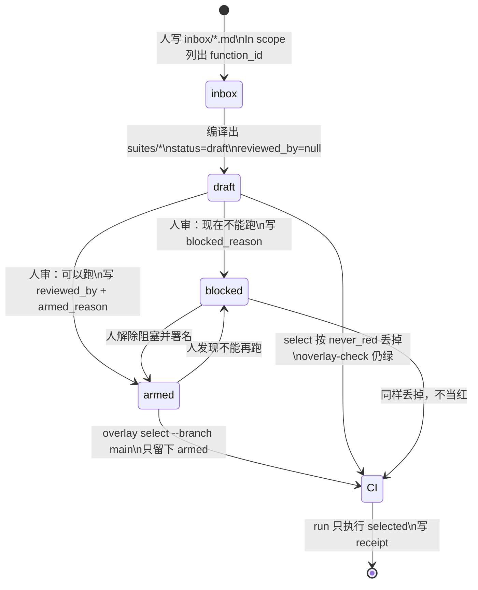
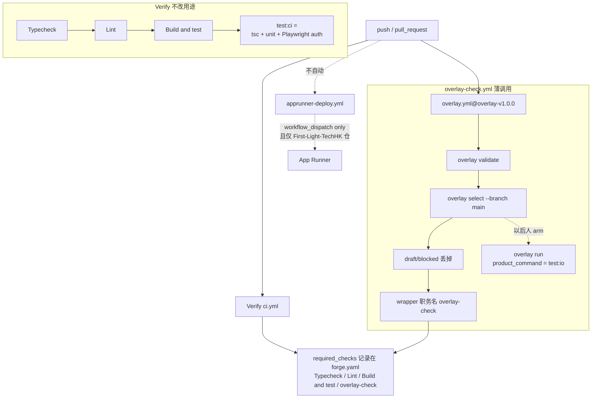
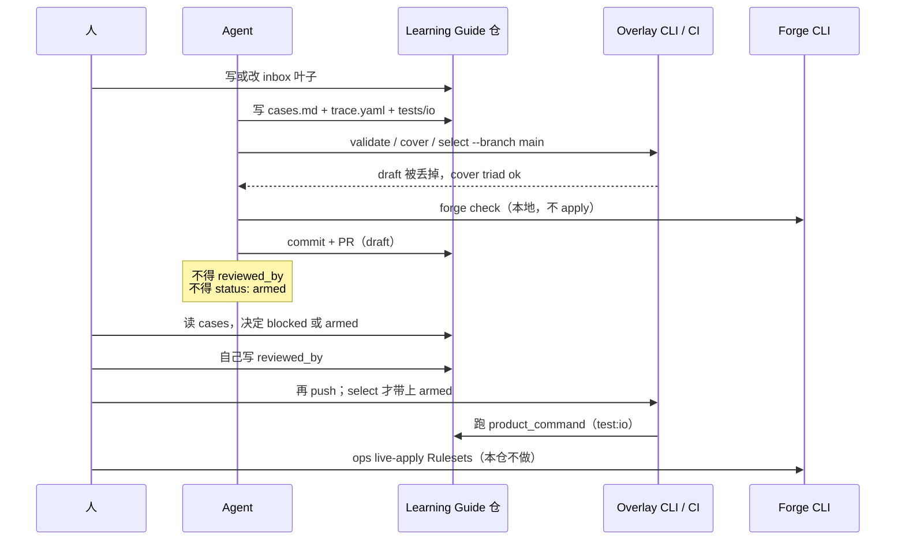

# Overlay + Forge 协作流程（Learning Guide 接入）

先看这一页。产品仓是 `LibertychaserUS/LearningGuidePortal`。工具仓是 `LibertychaserUS/AIOps`（发布针 `overlay-v1.0.0` / `forge-v1.0.0`）。
这不是 KS。不改 Verify 的用途。不 live-apply Rulesets。不 vendor `overlay/` 或 `forge/`。Agent 不得写 Overlay 的 `reviewed_by`，不得把套件标成 `armed`。

---

## 1. 两件产品各管一段

```text
Forge          谁能推、谁开 PR、哪些路径不能改、required checks 叫什么
               本地：forge check → forge submit（要 FORGE_SUBMIT_TOKEN）
               Ops 才 apply Rulesets；Forge 自己不 merge

Overlay        需求叶子 → 可审用例 → CI 只跑 armed
               状态：draft | blocked | armed
               1.0.0 不带 generate。人审之前套件必须是 draft 或 blocked
```

Learning Guide 只接 **薄文件**：`forge.yaml`、`overlay.yaml`、`inbox/*`、`suites/*`、`invariants.yaml`、`.github/workflows/overlay-check.yml`。

---

## 2. 状态机（UML）



规则：

- `never_red_statuses: [draft, blocked]`。main 上的 select 丢掉它们，check 不红。
- Agent 可以写 inbox / cases / trace / 产品 I/O。Agent **不能** 填 `reviewed_by`，**不能** 把 `status` 写成 `armed`。
- `product_command` 指向 `tests/io/*.test.ts`。人 arm 之前这条命令不会进 CI。

---

## 3. 产品仓 CI DAG



不要做的：

- 不要把 workshop `ci.yml` 的 pr-title / sop-lock 抄进 Learning Guide。
- 不要把 e2e / k6 / 生产冒烟加进 Verify。
- 不要自动 App Runner。
- 不要打 `ilovelearningguide.com`。

---

## 4. 人与 agent 怎么配合（时序）



---

## 5. 本仓当前针脚

| 文件 | 作用 |
|---|---|
| `forge.yaml` | 保护 `main`；deny `ci.yml` / `apprunner-deploy.yml` / `overlay-check.yml`；required_checks 含 `overlay-check`；`code_owners: false` |
| `overlay.yaml` | `product.repo: LibertychaserUS/LearningGuidePortal`；`default_ref` 钉在 `6d8934e…`；`forbid_hosts: ilovelearningguide.com` |
| `inbox/login.md` | AUTH-01..06 |
| `inbox/payment.md` | PAY-01..10 |
| `suites/login` `suites/payment` | `status: draft`，`reviewed_by: null` |
| `invariants.yaml` | `INV-unauth-no-grant` / `INV-browser-not-price` / `INV-one-charge` |
| `.github/workflows/overlay-check.yml` | `uses: LibertychaserUS/AIOps/.github/workflows/overlay.yml@overlay-v1.0.0`，`branch: main`，`enable_run: true` |

发布针只认 tag，不认 `main`：`overlay-v1.0.0` / `forge-v1.0.0`（同一 SHA `235e514…`）。

---

## 6. 本地命令

```text
npm run test:io
PYTHONPATH=/tmp/AIOps python3 -m overlay validate --root .
PYTHONPATH=/tmp/AIOps python3 -m overlay cover --root .
PYTHONPATH=/tmp/AIOps python3 -m overlay select --branch main --root .
PYTHONPATH=/tmp/AIOps python3 -m overlay run --branch main --root . --workdir . --write-receipt /tmp/lg-receipts-run
PYTHONPATH=/tmp/AIOps python3 -m forge check --root .
```

`select --branch main` 现在 selected=0。人 arm 之前 overlay-check 保持绿。
