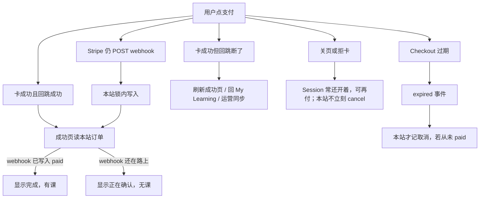

# 支付成功状态如何传到全链路

本文记录当前实现，不是新设计。对应代码以 `services/productStore.ts`、`app/api/payment/webhook/route.ts`、`app/[locale]/portal/payment/success/page.tsx` 为准。

**固定事实：** 浏览器回成功页 ≠ 已付款。课程开通只认服务端在 webhook（或运营 Resynchronise，或本地 demo confirm）之后写入的 Order / Subscription / Entitlement。浏览器不能决定价格、Order、Payment、Subscription、Entitlement 或 Course 访问权限。

发群可直接丢这一份。微信 / 飞书不渲染 Mermaid，文里每张图都附了 ASCII。

---

## 1. Hop 是什么

**Hop** 是评审和 Overlay I/O 里说的「链路里的一步」，不是 Stripe 术语。

例如 `register → verify-email → login` 里，每跳一次 HTTP 就是一个 hop。支付主链是：

```text
quote → checkout →（用户在 Stripe）→ webhook → order.paid → entitlement → 进课
```

说「链 hop 没测完」的意思是：`tests/io/payment.test.ts` 多半停在 quote / checkout / demo confirm，没有接着走**匹配的已付 webhook、升级全路径、进课**。

本地 demo（`PAYMENT_MODE=demo`）没有 Stripe webhook，只有 `POST /api/purchase/demo/confirm`。下面「回跳不是凭证」主要针对 `PAYMENT_MODE=stripe`。

---

## 2. 谁有资格写「成功」

只有四条入口会把钱变成课。它们最后都进 `editData` 同一把锁。

| 入口 | 何时 | 写什么 |
|---|---|---|
| `POST /api/payment/webhook` | Stripe 签过名，且 `payment_status` 是 `paid` / `no_payment_required` | 普通购：`fulfilStripeCheckout` → `grantPurchaseAccess`；升级：`fulfilUpgrade`；试用：`activateStripeTrial` |
| `invoice.paid` | 试用转正或续费 | `convertStripeTrial` 或 `applyStripePaidInvoice` |
| `POST /api/purchase/demo/confirm` | 本地 `PAYMENT_MODE=demo`，用户点完成 | 同一请求里 `completeDemoOrder`，立刻 `paid` |
| Backoffice Resynchronise | Webhook 丢了，运营向 Stripe `retrieve` | `applyStripeOrderState`；`stripeStatus=paid` 时走同一套 grant / upgrade / trial |

成功页、Checkout `success_url`、前端 `fetch` **都不写** Order / Entitlement。

`invoice.paid` 金额 ≤ 0 不转正试用。`$0` 且 subscription 仍 `trialing` 的发票直接忽略。

---

## 3. 网络波动时三边怎么处理

钱在 Stripe。本站只认：**验签 webhook、金额币种对得上、同一 event 不重复开通**。

### 3.1 用户侧

用户在 **Stripe Checkout**（卡、3DS）上付钱。本站只给两个回跳：

- 成功：`/{locale}/portal/payment/success?orderId=…`
- 取消：确认页 + `quoteId`

成功页只读本站订单，不向 Stripe 再问一次：

| 本站订单 | 页面 |
|---|---|
| `paid` | 购买完成，可以去上课 |
| `pending` | 「支付正在确认」—— Stripe 还没把结果写回来 |
| `failed` / `canceled` | 失败文案 |
| 没有订单 | 未知 |

中文文案：可以先回 My Learning，稍后刷新。页上显示当前 **active entitlement 数量**；webhook 还没到时，这里通常还是 0。

断网常见几种：

1. **卡已扣、回跳断了** — Stripe 会话可能已付。用户再开成功页，若 webhook 没到，仍是 pending，**不会当场开课**。
2. **关了 Checkout 标签** — 会话往往还开着，可以再付。本站**不会**因为关页就记取消；要等 `checkout.session.expired`。
3. **卡被拒** — 会话未过期就可以重试，不必立刻新开一单。
4. **点了取消 / 没付完** — 回确认页。订单仍可能是 pending，直到过期事件或运营同步。
5. **本地 demo** — 走 `/portal/payment/checkout` + `POST /api/purchase/demo/confirm`。同一 quote 复用同一张 pending 单（PAY-03），避免连点出两单。

成功页是**一次服务端渲染**，没有自动轮询。用户要自己刷新，或等运营点 Resynchronise。

### 3.2 本站支付侧

**下单**

- Quote **15 分钟**有效。过期再 checkout 会失败，不会拿过期价去 Stripe。
- 正式购买创建 Checkout 时带幂等键：`lg-checkout-${orderId}`。同一 Order 因超时重试，Stripe 应复用同一 Session。
- 同一 Order **不会覆盖**已记下的 `stripeCheckoutSessionId`。
- **升级 / 试用**的 hosted checkout **没有**设这个幂等键——断网连点时，这两条比普通购买更容易重复建 Session。

**Webhook**（`POST /api/payment/webhook`）

| Stripe 情况 | 本站 |
|---|---|
| 没签名 / 没 secret | **503**，Stripe 会重试 |
| `payment_status=unpaid` | **200** `{ pending: true }`，**不开课** |
| 已付 / `no_payment_required` | 金额币种必须等于订单，否则 **400**（Stripe 再投） |
| 同一 `eventId` 再来 | 锁里认领，返回 `{ duplicate: true }`，不再开第二份权 |
| `checkout.session.expired` / `async_payment_failed` | 未付则失败/取消；**已经 paid/refunded 的不撤回** |
| 处理函数抛错 / 400 | Stripe 继续重试；**200 才停** |

发票事件是 **先处理成功，再标记 processed**。Checkout 路径在锁内认领 `eventId`。发票路径「先读是否处理过、再处理、再标记」中间有一小段窗口，高并发下不如 Checkout 干净。

Webhook 丢了、用户已扣款：运营 Backoffice **Resynchronise** 向 Stripe `retrieve` 会话，再 `applyStripeOrderState`。Stripe 报错则 **502**。这是人工补洞，不是用户按钮。

本站不会根据「用户到了 success URL」开通，也不会让浏览器决定价格或权。

### 3.3 Stripe 侧

Stripe 管卡、3DS、是否真的扣到钱。Session 一直开到：**已付、过期、或放弃后超时**。

- Webhook **至少投一次**。本站非 2xx 就按他们的退避重试。
- 普通购买的 `idempotencyKey`：同一 key 在窗口内再 `create session`，应返回第一次那个 Session。
- 异步支付（部分银行）：可能先来 `checkout.session.completed` 且仍是 **unpaid**，再来 `async_payment_succeeded` 或 `async_payment_failed`。本站对 unpaid **200 但不授权**；成功事件到了才开通；失败事件到了才关单，且不撤已成功的单。

**Stripe 以自己的 Session / Charge 为准；本站以签过名的事件 + 订单金额为准。两边暂时对不上时，用户看到 pending，课先不开。**

### 3.4 断网时谁先对上号



```text
用户点支付
    │
    ├─ 卡成功，回跳也成功 ──► 成功页读本站订单
    │         │                    │
    │         │                    ├─ webhook 已写入 paid ──► 显示完成，有课
    │         │                    └─ webhook 还在路上   ──► 显示「正在确认」，无课
    │         │
    │         └─ Stripe 仍会 POST /api/payment/webhook（独立通道）
    │
    ├─ 卡成功，回跳断了 ──► 用户以为没付完；钱可能已扣
    │                      刷新成功页 / 回 My Learning / 运营同步
    │
    ├─ 关页 / 拒卡 ──► Session 常还开着，可再付；本站不立刻 cancel
    │
    └─ Checkout 过期 ──► expired 事件 ──► 本站才记取消（若从未 paid）
```

---

## 4. 一次写入里同时改什么

普通购买（`grantPurchaseAccess`）在**同一把锁**里：

1. 认领 `eventId`（进 `stripeEvents`，重复 webhook 直接 `{ duplicate: true }`）
2. 找到订单（`sessionId` 或 `quoteId`），校验金额、币种、plan
3. `order.status = "paid"`，补上 session / subscription / paymentIntent，写入服务期
4. 新建一条 `subscription`（`source: purchase`，`validTo = 现在 + 月数`）
5. 同 plan 的 trial subscription 标 `expired`
6. 范围重叠的旧 `entitlement` 标 `expired`，再 `unshift` 一条新的 `active`
7. 往 `notifications` 塞一条 “Purchase complete”（**My Learning 收件箱不会展示**，见第 6 节）

升级会先把源订阅和对应 entitlement 到期，再开 Everything。试用开 3 天 trial 权。续费发票通常**不新建 entitlement**，只把现有权的 `validTo` 往后推，并可能再插一张 invoice order。

领域规则要求这些在一个事务里完成。本地 / 当前云存储是整份 JSON 的 `editData`，不是按表的 SQL 事务。多实例整份文档存储不能代替跨实例的订单库。

---

## 5. 成功之后怎么传到全链路

没有 WebSocket、没有支付轮询、没有消息队列。传播 = **下一次请求读 store**。

```mermaid
flowchart TD
  stripe[Stripe 扣款成功]
  stripe --> hook[独立通道: POST /api/payment/webhook]
  hook --> write[验签后 fulfil / trial / invoice]
  write --> lock[同一把锁: order.paid + subscription + entitlement + stripeEvent]
  stripe --> jump[用户浏览器 success_url]
  jump --> ssr[成功页 SSR: getOrderForUser + getLearningOverview]
  ssr -->|paid| complete[购买完成]
  ssr -->|pending| wait[支付正在确认]
  complete --> click[用户点进 My Learning / 课程 / 学习室 / AI Tutor]
  wait --> click
  click --> gate[各页自己再读 entitlement]
```

```text
Stripe 扣款成功
    │
    ├─（独立通道）POST /api/payment/webhook
    │       │ 验签 → fulfil / trial / invoice
    │       ▼
    │   同一把锁写入：
    │     order.paid + subscription + entitlement + stripeEvent
    │
    └─（用户浏览器）success_url
            │
            ▼
      成功页 SSR：getOrderForUser + getLearningOverview
            │  paid →「购买完成」
            │  仍 pending →「支付正在确认」（webhook 还没到）
            ▼
      用户点进 My Learning / 课程 / 学习室 / AI Tutor
            │
            ▼
      各页自己再读一遍 entitlement
```

各表面读的不是「支付事件」，而是不同切片：

| 表面 | 读什么 | 用户看到什么 |
|---|---|---|
| `/portal/payment/success` | 这一单的 `order.status`；overview 里 **active entitlement 条数** | paid 才显示完成；pending 不说已开通 |
| My Learning 顶栏「当前访问」 | `entitlements`：`state=active` 且 `validTo > now` | 文案变成 Everything / 分类 / 课名 |
| My Learning 课程卡片 | **只来自 `studyRecords`**，不是来自新买的权 | 从没学过的课，买完卡片列表仍可能是空的；要从课程页再进 |
| `/account/learn/[courseId]` | `checkEntitlement` | `allowed=false` → 打回课程介绍页 |
| `GET /api/entitlements/check` | 同上；带 `device=pc\|mobile` 才比设备带 | 学习室、AI Tutor 用来挡未购 |
| `recordStudyEvent(access=paid)` | `activeEntitlement` | 没权直接抛错，进度写不进去 |
| 收据 | `order.status === "paid"` 且不是 trial | 未付 404 |
| Backoffice 订单 | `order.status` + 同步记录 | 运营列表 / 导出 |
| 通知表 | 写入了 title/body | **Overview 和 `/api/my-learning/notifications` 固定返回空数组**（产品占位 ML-FR-019，不是没写上） |

进课闸门是 `checkEntitlement`：课必须 `published`，权必须 `active` 且未过期，范围能盖住这门课。`device` **只有调用方传了才过滤**；学习页现在没传 device，PC/手机带在学习室这条链上不会自动挡。

`getLearningOverview` 每次还会把过期的 entitlement / subscription 标成 `expired`。这是读时修正，不是支付推过来的。

---

## 6. 其他页面怎么更新新状态

**其他页不会被通知。** Webhook 只改 store；别的页面既不订阅、也不轮询。用户**再打开或刷新那一页**时，服务端再读一遍，才换文案和按钮。

唯一例外：学习室里点完课时 `router.refresh()`，那是进度，不是支付。

### 6.1 导航 / 刷新时重读

这些页都是 Server Component。每次请求带 session，现查 store，再渲染：

| 用户去哪 | 这次请求读什么 | 买成功后应变成 |
|---|---|---|
| 成功页再刷一次 | 这一单 `order.status` + active 权条数 | pending → 完成 |
| My Learning | `getLearningOverview` | 顶栏「当前访问」有 scope；课卡仍可能空（要先有学习记录） |
| 订阅页 | overview 的 subscriptions / orders | 出现新订阅；订单变 paid |
| 课程介绍 | `getCoursePage(slug, userId)` | CTA 从「看套餐」变成「继续学习」；课时从 locked → entitled |
| `/account/learn/...` | `checkEntitlement` | `allowed` 才进学习室；否则打回介绍页 |
| 公开预览课 | overview（已登录时） | 仍可预览；完整课要进 learn |
| 收据链接 | 订单必须已 paid | 未付仍 404 |
| Backoffice 订单 | `listOperatorOrders` | 运营刷新列表才能看到 paid |

`<Link>` 软跳和地址栏重开，对这类带 cookie 的动态页都会重新打服务端。**已经停在旧页、不去动的那个标签页，会一直显示付款前的 HTML。**

本地 demo 是 `window.location.assign` 去成功页，整页重载，所以成功页一定是新渲染。Stripe 回 `success_url` 也是整页打开。从成功页点「继续」去 My Learning，是一次新的 SSR。

### 6.2 已经打开的页：客户端还拿着旧 props

部分组件第一次渲染后把服务端数据存进 React state，**不会**在 webhook 到达后自己再 fetch。

- **订阅页 `SubscriptionManager`**：`initialSubscriptions` / `initialOrders`。人坐在这页时，后台开通了也不会改表。要离开再进，或浏览器刷新。
- **学习室 `LearningRoom`**：只在进页时用 `initialCompleted`；`open` / `complete` 是打 `/api/study/events`。闸门在进页的 `checkEntitlement`。付款前就打开的学习室（或公开预览）不会自己变成已购完整课。
- **购买 / 升级面板**：只在用户再点报价时打 `/api/subscription/quote`。服务端若发现已有 active 订阅会拒「再买一份」，但这要等用户再点一次。
- **页头**：没有「已购 / 未购」实时标记，只有登录态。

所以：A 标签付完款，B 标签还停在课程介绍或订阅页 → B **不会变**，直到刷新或再点进该路由。

### 6.3 API 是另一次「拉」，不是推

用户在别的页上点了动作，那一次请求会重新看权：

```text
学习室 POST /api/study/events     → 没权就写不进进度
AI Tutor POST /api/ai-tutor       → 先 checkEntitlement
GET /api/entitlements/check       → 当时有没有权
GET /api/my-learning              → 当时的 overview
GET /api/subscription             → 当时的订阅列表
```

这些 route 大多是 `force-dynamic`。**请求当下**和 store 一致；没有人在后台把结果推给已打开的页面。

通知写入了 store，但 My Learning 通知页和 `/api/my-learning/notifications` **固定空列表**，付款成功不会在铃铛里冒出来。

### 6.4 用户实际会怎么「看到更新」

```text
Webhook 已写入 paid + entitlement
        │
        │  （其他已打开的页：还是旧 HTML）
        ▼
用户点链接 / 刷新 / 从 Stripe 整页回来
        │
        ▼
该页 Server Component 再跑一遍
        │
        ├─ 成功页 → 读这一单
        ├─ My Learning → 读权（顶栏）
        ├─ 课程介绍 → 重算 CTA / 课时锁
        ├─ 学习室 → 再 check，没权就重定向
        └─ 订阅页 → 用新 overview 当 initial props
```

没有自动轮询。成功页文案也写了：先回 My Learning，**稍后刷新**。那就是全站的更新模型。

---

## 7. 三条「成功」时间线

**1. Stripe 正常购（最常见）**

```text
quote(15min) → 建 pending order → 开 Checkout（幂等键 lg-checkout-{orderId}）
    → 用户在 Stripe 付钱
    → webhook：unpaid 只回 200，不开课
    → webhook：paid → 锁内 grant
    → 用户刷新成功页才从 pending 变成完成
    → 再进 My Learning / 课程页，闸门放行
```

Webhook 晚到：钱已扣，本站仍 pending，课不开。补洞是运营 Resynchronise，不是成功页自动再问 Stripe。

**2. 本地 demo**

`demo/confirm` 和开通在**同一次 POST**里完成，然后 `window.location` 去成功页。成功页读到的已经是 paid。没有 Stripe hop，也没有「先 pending 再刷新」。

**3. 续费 / 试用转正**

不是用户回成功页。`invoice.paid` 自己写：转正会新建 paid order + 新 purchase 权；续费延长 `validTo`。用户下次打开学习页才感觉「还能学」。

---

## 8. 全链路在本站停在哪

```text
Stripe paid
  → webhook 写入 store          ← 唯一权威扩散点
      → order.paid              ← 成功页、收据、Backoffice
      → subscription.active     ← 订阅页、能否再 quote
      → entitlement.active      ← 进课、AI Tutor、学习事件
      → notification 行         ← 写了，My Learning 不展示
      → study 卡片              ← 不会自动出现；要先有学习记录
      → 浏览器其它页            ← 不推送；要导航或刷新
```

所以「传播到全链路」的准确说法是：

1. **写入是扇出的**：一笔成功同时改 Order、Subscription、Entitlement（以及事件去重）。
2. **读取是拉的**：每个页面自己查；没有总线把「paid」广播出去。
3. **学习卡片不是支付的下游**：支付只保证顶栏访问文案和进课闸门；课卡要等用户真的学过。

Store 里的状态已经是新的；**页面状态是各页自己的快照**。

- 新开页 / 刷新 → 快照追上 store
- 停在旧页 → 快照落后
- 客户端列表（订阅表、课卡）→ 落后到下一次进页

若要「付完所有打开的页一起变」，现在没有这条通道，得加轮询、`router.refresh()` 定时器，或推送。当前产品没有做。用户路径就是：**付完 → 成功页（可能还 pending）→ 自己再进 My Learning / 课程页。**

---

## 9. 实现缺口（记录，不是本文件的修复单）

1. 升级 / 试用创建 Session **没有** `lg-checkout-${orderId}` 这种幂等键。
2. 成功页不轮询；用户只能手动刷新，或等运营同步。
3. `invoice.paid` 认领不在锁内，存在先读后写窗口。
4. `applyStripeOrderState` 试用路径仍 `filter()` 删除重叠 entitlement（PAY-08）。
5. `checkEntitlement` 的 `device` 只有调用方传入才生效；学习页未传。
6. `markStripeSubscriptionGrace` 写了 `graceEndsAt`，`checkEntitlement` 不读它。
7. Overlay I/O 尚未走完：匹配的已付 webhook、升级全链路、成功页 pending→paid、进课。
8. 不要把上述缺口加进 Verify 的 `test:ci`。半锁叶子留在 Overlay cases，等人 arm。

相关：`docs/phase1/stripe-sandbox.md`（sandbox 行为）、`docs/phase1/overlay-forge-brief.md`（AUTH / PAY 缺陷与 hop 覆盖）、`docs/phase1/domain-model.md`（状态必须同事务写入）。
