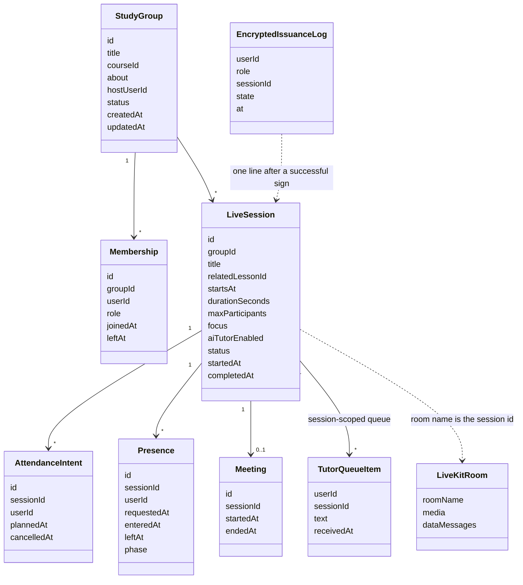
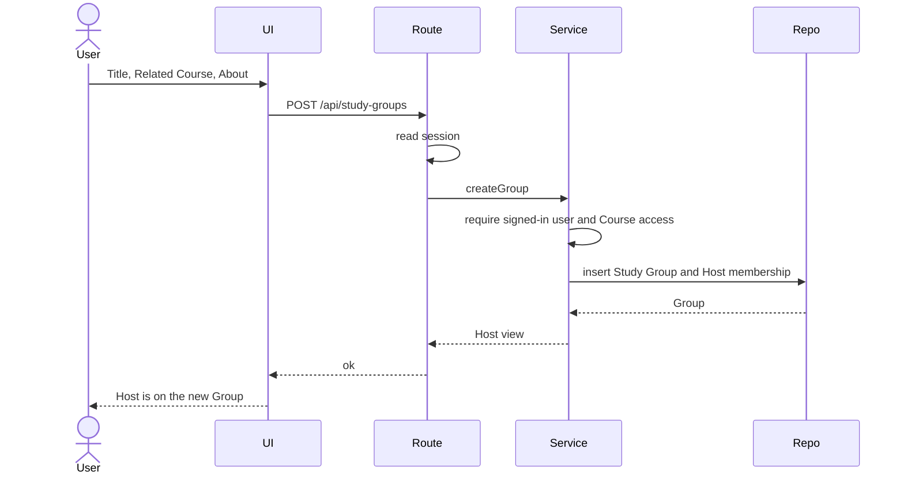
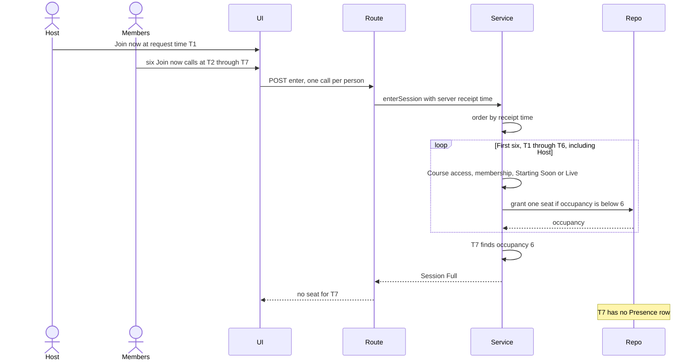
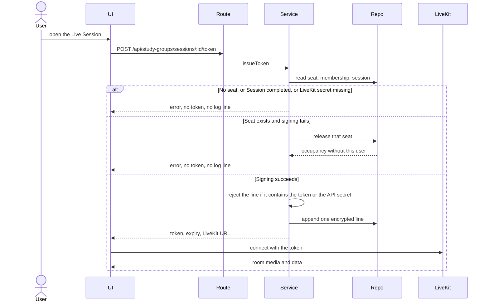
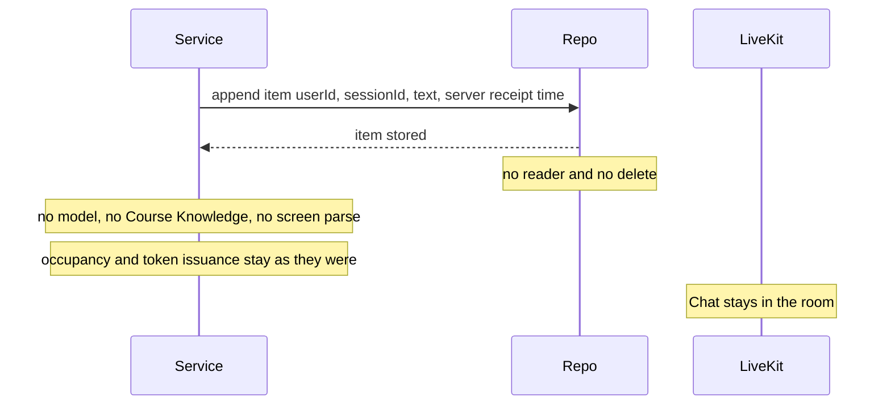
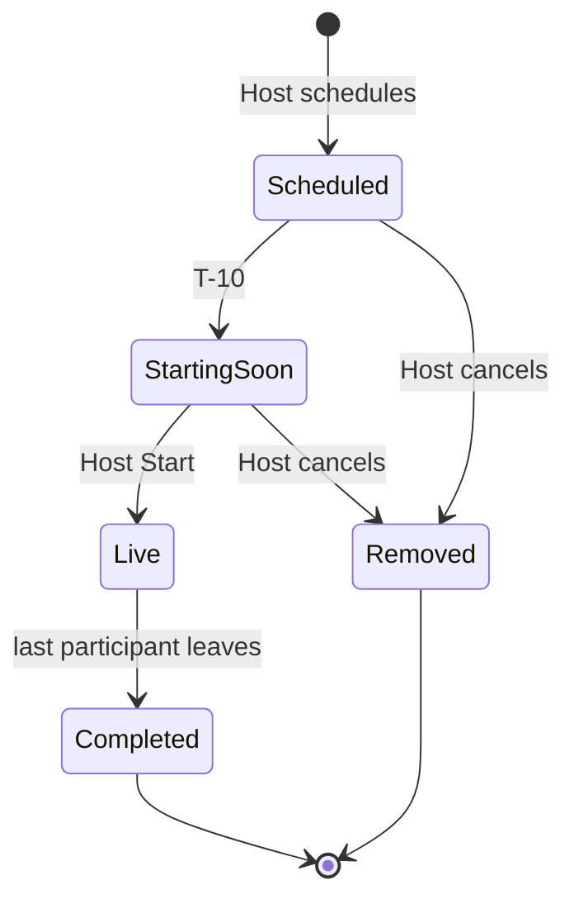

# Study Group UML

Diagrams for PRD v0.10, the locked decisions, and branch `cursor/study-group-backend-7481` at `18a1046ec71853f77d1b73eda545526c58964826`. Layer names match the architecture note.

Session Title is required and is at most 20 characters. That limit is the Figma counter `7/20`. It is not drawn below, because none of these sequences edit the title string.

## Class diagram

`EncryptedIssuanceLog` is one ciphertext line per successful issuance. It is not a token table. `LiveKitRoom` is the cloud room. Chat bytes stay there.

`AttendanceIntent` does not hold a seat. `Presence` holds a seat while `enteredAt` is set and `leftAt` is empty. `Meeting` exists only after Host Start, one row for that Live Session.

`durationSeconds` is one of 1800, 2700, 3600, or 5400. Those are the choices 30, 45, 60, and 90 minutes. The Figma session card shows `45 mins`. Branch `18a1046` still names the field `durationMinutes` and accepts any integer of at least 1.

`TutorQueueItem` is one undrained queue item. `receivedAt` is the server receipt time. The queue is not Chat, and it is not a seat or a token. Branch `18a1046` does not have this queue.

## Create Study Group

The page collects Title, Related Course, and About. The service checks Course access. The repository inserts the Group and the Host membership together.

Cancel on the form writes nothing.

## Join the Live Session, six-person race

The cap is the Session maximum, from 2 to 6, and the person count includes the Host. Admission is first come, first served by the time the server receives the enter request. This diagram uses a Session whose maximum is 6. Seven enter requests arrive. The first six include the Host. The seventh does not get a seat.

Plan to Attend is not an enter request and is not in this race. A person who is already seated is not granted a second seat.

The seat grant is the repository write. Token signing is a later step and is not part of this loop.

## Token issuance

The service signs the token only after a seat exists. The token grants join, publish, subscribe, and data. It has no Host label. On a signing failure the seat from this operation is removed before the error returns. No log line is written. On success the repository appends one encrypted line, then the token goes to the browser. LiveKit sees the token only after that.

Chat and Raise Hand after connect are LiveKit data messages. They do not call the repository. They do not append a tutor-queue item.

## AI Tutor queue

The queue belongs to one Live Session. The service appends an item. Nothing drains it. The append does not read occupancy and does not sign a token. Chat remains a LiveKit data message and does not become this item.

## Live Session state

Cancel before start removes the record from the lists. There is no Cancelled card. The clock reaching the scheduled time does not enter Live. The planned duration ending does not enter Completed. Completed is the last participant leaving after Host Start.

Waiting for Host Start is the page a Joined Member sees after enter during Starting Soon. It is not a second Session state. Those people already count in occupancy. Host Start moves them to Live without a second enter, and the occupancy count stays.
